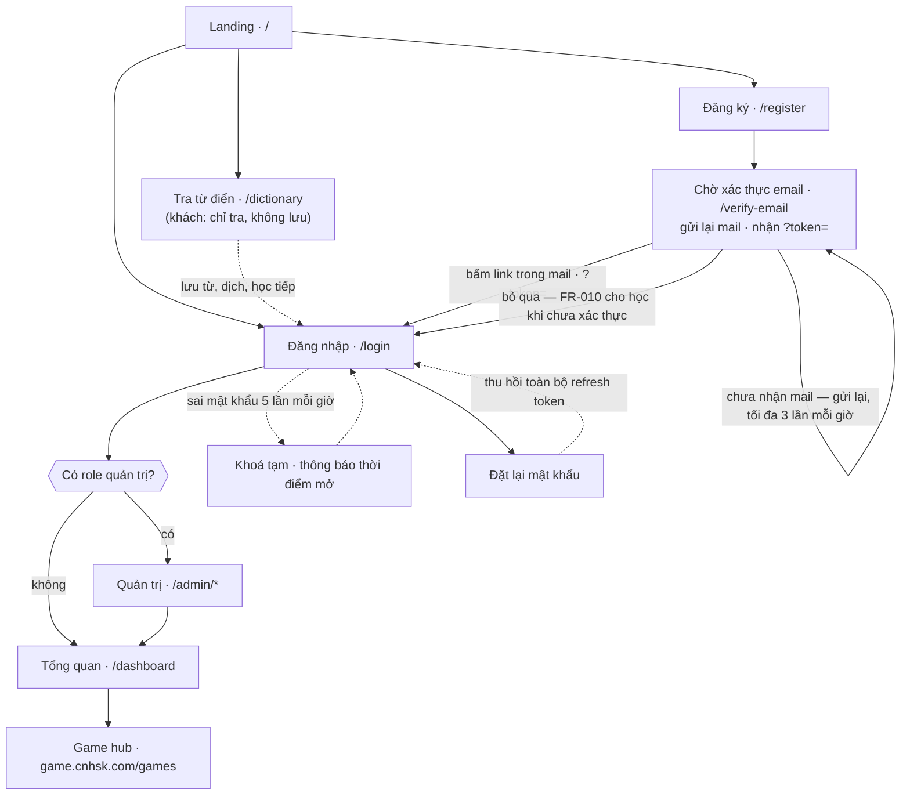
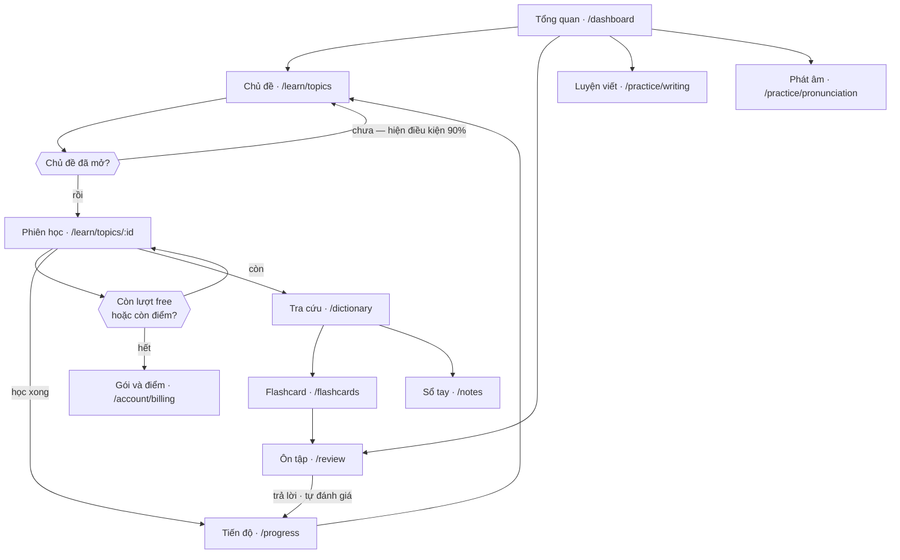
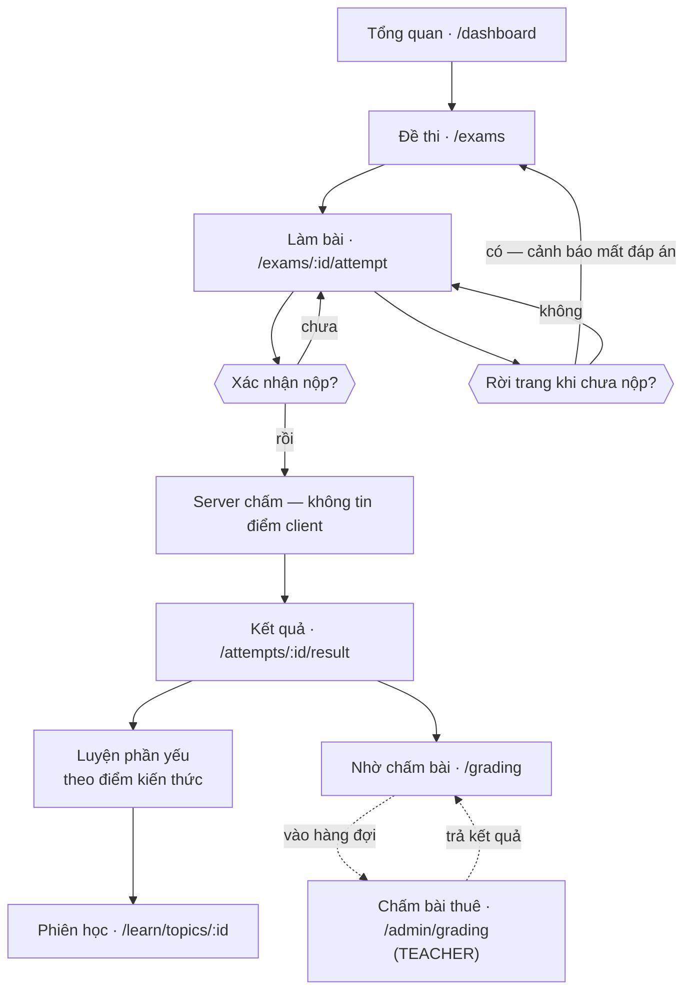
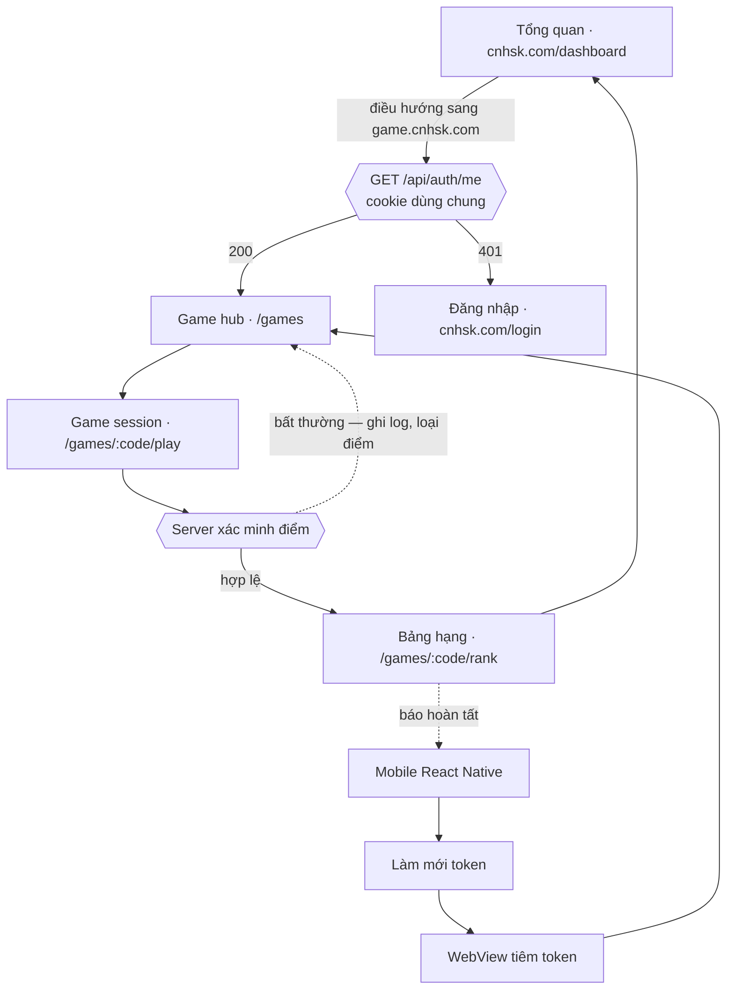
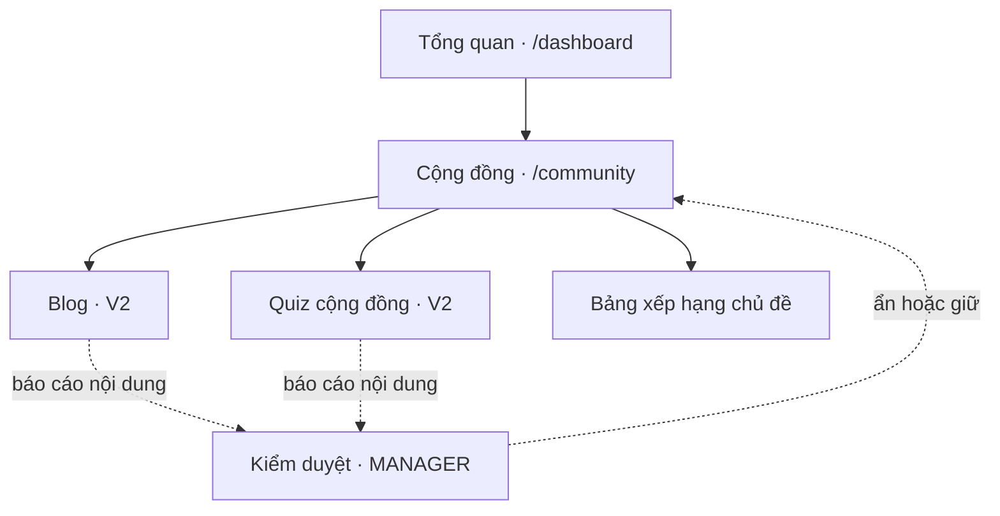
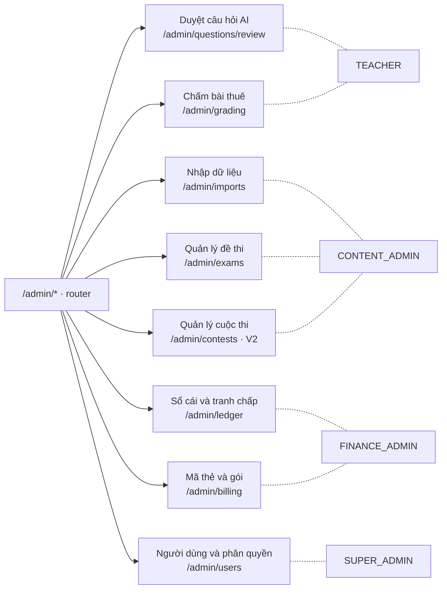
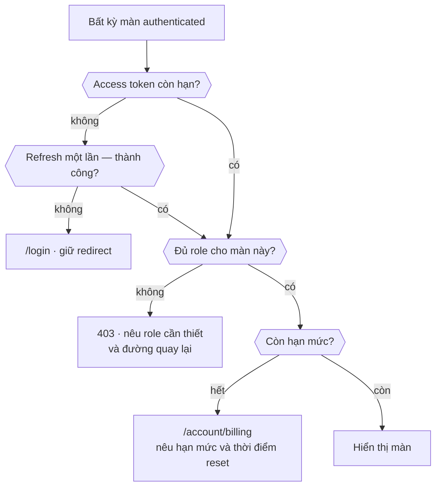

# CNHSK — Design Guidelines

| | |
| --- | --- |
| **Trạng thái** | Bản final |
| **Status** | DRAFT |
| **Owner** | Nhóm CNHSK |
| **Approved by** | Chưa duyệt |
| **Locked on** | Chưa khóa |
| **Sprint** | Khung giao diện ban đầu |

---

## 0. Phạm vi và cách dùng tài liệu

Đây là nguồn quy định thiết kế dùng chung cho web chính, web game và ứng dụng
React Native. Khi tài liệu này khác với một mockup hoặc quyết định miệng, nhóm
SHALL cập nhật và duyệt tài liệu trước khi triển khai khác đi.

Tài liệu tham khảo:

- [Học Bá Education](https://hoc-ba.edu.vn/): nguồn tham khảo cho nhận diện đỏ
  Trung Hoa, màu nhấn vàng, độ tương phản và cảm giác giáo dục chuyên nghiệp.
- [Hanzi Cozy Diary](https://CNHSK.today/): nguồn tham khảo cho cách nhóm
  công cụ theo kỹ năng, card tính năng, lộ trình học và phân cấp nội dung.
- `docs/feature-tree.md`: nguồn sự thật về tính năng và phạm vi.
- `docs/kien-truc.md`: nguồn sự thật về ba client và xác thực.

Chỉ học nguyên tắc thiết kế; không sao chép logo, ảnh, minh họa, nội dung, font
độc quyền hoặc bố cục nguyên bản của website tham khảo.

---

## 1. Context & Goal

**Vì sao file này tồn tại:** CNHSK có ba client do nhiều thành viên phát
triển song song. File này giữ một ngôn ngữ thị giác thống nhất, giảm quyết định
tùy ý và giúp người học nhận ra cùng một sản phẩm khi chuyển giữa web, game và
mobile.

**Nguyên tắc thiết kế, xếp theo thứ tự ưu tiên:**

1. **Việc học quan trọng hơn trang trí:** nội dung, đáp án và tiến độ SHALL rõ
   hơn hình minh họa hoặc hiệu ứng.
2. **Nhất quán xuyên nền tảng:** semantic token và trạng thái SHALL giữ cùng ý
   nghĩa; cách bố trí MAY thích nghi theo thiết bị.
3. **Một hành động chính mỗi vùng:** mỗi card, dialog hoặc màn hình SHALL có tối
   đa một CTA primary.
4. **Hiển thị tiến độ có ngữ cảnh:** phần trăm, mastery hoặc chuỗi ngày SHALL đi
   kèm nhãn giải thích, không dùng màu làm tín hiệu duy nhất.
5. **An toàn trước tiện lợi:** thao tác tài khoản, điểm tài chính, nộp bài và rời
   phiên thi SHALL ưu tiên xác nhận và khả năng phục hồi.

---

## 2. Ràng buộc kỹ thuật

| Hạng mục | Giá trị |
| --- | --- |
| Web chính | React 18.3.x + TypeScript 5.x + Vite 5.x |
| Web game | React 18.3.x + TypeScript 5.x + Vite 5.x; Phaser 3 hoặc Canvas chỉ nằm trong vùng game |
| Mobile | React Native + Expo + TypeScript; phiên bản chốt khi bắt đầu giai đoạn mobile |
| Runtime web | Node.js 22 LTS hoặc Node.js 24 theo môi trường đã chốt |
| Design system web | shadcn/ui + Tailwind CSS; component được sở hữu trong source của dự án |
| Design system mobile | React Native core + NativeWind; ánh xạ cùng semantic tokens với web |
| Icon | Lucide React / Lucide React Native; nét 1.75–2 px |
| Biểu đồ | Recharts trên web; thư viện mobile sẽ chốt khi làm màn thống kê |
| Thư viện bị cấm | Không trộn thêm Material UI, Ant Design, Bootstrap hoặc UI kit toàn cục khác |
| Nền tảng phải hỗ trợ | Desktop web, mobile web, Android và iOS qua React Native |
| Trình duyệt / OS tối thiểu | Xem Open Questions #1 |

THE system SHALL dùng component semantic như `Button`, `Card`, `Progress`,
`Dialog`, `FormField`; không tạo bản sao theo từng trang.

---

## 3. Actors & phạm vi màn hình

| Actor | Quyền | Thiết bị chính | Nhóm màn hình được dùng |
| --- | --- | --- | --- |
| Khách | Xem giới thiệu và trang công khai, tra từ điển, đăng ký/đăng nhập — không dùng thử tính năng (mục 5.5) | Web, mobile | Public, auth |
| USER | Học, luyện, thi, chơi, dùng thư viện và cộng đồng | Web, mobile | Toàn bộ màn học viên |
| TEACHER | USER + duyệt nội dung, chấm bài thuê | Desktop web | Học viên, hàng đợi duyệt/chấm |
| MANAGER | USER + kiểm duyệt cộng đồng | Desktop web | Học viên, quản trị cộng đồng |
| ADMIN | Quản trị toàn hệ thống | Desktop web | Học viên và admin |

**Ranh giới giữa các nền tảng:**

| Tính năng | Web chính | Web game | React Native |
| --- | --- | --- | --- |
| Tài khoản, học tập, thi, tra cứu | Có | Không | Có |
| Game | Điều hướng sang web game | Có | WebView tải chính web game |
| Blog, quiz, xếp hạng | Có | Chỉ bảng hạng game | Có |
| Quản trị và duyệt nội dung | Có, tối ưu desktop | Không | Không trong MVP |
| Thanh toán/điểm | Có | Không | Có |

---

## 4. User flow

★ **Xác thực và vào hệ thống:** Landing → Đăng ký (nhận email xác thực) hoặc
Đăng nhập → Chọn cách gửi token theo client (web cookie · mobile header ·
WebView tiêm token) → Trang chủ học tập. Sai mật khẩu 5 lần/giờ → khóa tạm.
Đặt lại mật khẩu → thu hồi **toàn bộ** refresh token.

★ **Học theo chủ đề:** Đăng nhập → Trang chủ học tập → Chọn chủ đề đã mở →
Học từ → Luyện nhận diện/nghe/viết → Kiểm tra → Xem mastery và chủ đề kế tiếp.

★ **Làm đề và sửa điểm yếu:** Chọn HSK/dạng đề → Làm bài → Xác nhận nộp →
Server chấm → Xem lỗi theo điểm kiến thức → Luyện ngay phần yếu.

★ **Ôn tập đến hạn:** Trang chủ → Danh sách đến hạn → Trả lời → Tự đánh giá
nếu là flashcard → Nhận lịch ôn mới → Xem tiến độ.

**Tra cứu để học:** Tìm chữ/từ/câu → Xem nghĩa, pinyin và cấu tạo → Thêm vào
flashcard hoặc sổ tay → Tiếp tục ngữ cảnh trước đó.

**Chơi game trên web:** Web chính → Web game → `/api/auth/me` → Chọn game →
Chơi → Server xác minh điểm → Xem thứ hạng → Quay lại trang chính.

**Chơi game trên mobile:** Mobile làm mới token → Mở WebView → Tiêm token →
Chơi → Gửi điểm → WebView báo hoàn tất → Mobile cập nhật tiến độ.

**Duyệt nội dung:** Đăng nhập bằng role phù hợp → Mở hàng đợi → Xem chi tiết →
Chấp nhận/từ chối kèm lý do → Chuyển mục tiếp theo.

---

## 5. Sơ đồ màn hình

Màn hình chia theo **hai ứng dụng web riêng** (kiến trúc bản 5) — không gộp chung
một bảng, vì web game là codebase độc lập và chỉ dùng chung backend + cookie.

### 5.1. Web chính — `cnhsk.com` (20 màn nội dung + 1 màn router)

| Màn hình | Route | Actor | Mục đích (1 câu) |
| --- | --- | --- | --- |
| Landing | `/` | Mọi người | Giới thiệu giá trị và đưa người dùng vào học |
| Đăng nhập / đăng ký | `/login`, `/register` | Khách | Xác thực tài khoản |
| Chờ xác thực email | `/verify-email` | Khách vừa đăng ký | Hướng dẫn mở mail, gửi lại mail, và nhận `?token=` từ link trong mail |
| Tổng quan học tập | `/dashboard` | USER+ | Việc cần học hôm nay, tiến độ và lối tắt |
| Chủ đề | `/learn/topics` | USER+ | Hiển thị cây chủ đề và trạng thái khóa |
| Phiên học chủ đề | `/learn/topics/:id` | USER+ | Học và kiểm tra từ trong một chủ đề |
| Ôn tập | `/review` | USER+ | Ôn các điểm kiến thức đến hạn |
| Luyện viết | `/practice/writing` | USER+ | Luyện thứ tự nét và nhớ chữ |
| Phát âm | `/practice/pronunciation` | USER+ | Học phát âm theo tám chặng |
| Đề thi | `/exams` | USER+ | Chọn đề HSK hoặc dạng câu hỏi |
| Làm bài | `/exams/:id/attempt` | USER+ | Làm và nộp bài |
| Kết quả | `/attempts/:id/result` | USER+ | Xem điểm, lỗi sai và điểm yếu |
| Tra cứu | `/dictionary` | Mọi người | Tra chữ, từ, ngữ pháp và dịch. Khách chỉ tra từ điển, không dịch, không lưu (mục 5.5) |
| Sổ tay | `/notes` | USER+ | Quản lý ghi chú cá nhân |
| Flashcard | `/flashcards` | USER+ | Quản lý và ôn bộ thẻ |
| Tiến độ | `/progress` | USER+ | Xem thống kê 7/30/90 ngày và mastery |
| AI Assistant | panel toàn cục | USER+ | Hỏi theo ngữ cảnh màn hình hiện tại |
| Gói và điểm | `/account/billing` | USER+ | Xem gói, số dư và nhập thẻ |
| Cộng đồng | `/community` | Mọi người | Blog, quiz và bảng xếp hạng chủ đề. Khách chỉ xem bài, bảng xếp hạng, cuộc thi (mục 5.5) |
| Nhờ chấm bài | `/grading` | USER+ | Gửi bài viết và xem kết quả chấm |
| Quản trị | `/admin/*` | 4 role quản trị (TEACHER · CONTENT_ADMIN · FINANCE_ADMIN · SUPER_ADMIN) | Xem mục 5.3 |

### 5.2. Web game — `game.cnhsk.com` (3 màn)

Ứng dụng **riêng biệt**: React + Phaser, codebase độc lập, dùng **cookie chung**
tên miền `cnhsk.com`. Mobile mở **chính các màn này** trong WebView.

| Màn hình | Route | Actor | Mục đích (1 câu) |
| --- | --- | --- | --- |
| Game hub | `/games` | USER+ | Chọn game và xem thành tích cá nhân |
| Game session | `/games/:code/play` | USER+ | Chơi một ván game |
| Bảng hạng game | `/games/:code/rank` | Mọi người | Xếp hạng riêng cho một game. Khách xem top, không có hạng cá nhân (UC-083) |

> Web game **không có** blog, quiz, học tập, thanh toán hay quản trị — xem ranh
> giới nền tảng ở mục 3. Trang game luôn bắt đầu bằng `GET /api/auth/me`.

### 5.3. Màn quản trị — `/admin/*` (8 màn)

Mỗi role **chỉ thấy phần mình quản** (nghiệm thu 6.6). Tách theo nhóm việc chứ
không theo role, vì một người có thể giữ nhiều role.

| Màn hình | Route | Actor | UC phục vụ |
| --- | --- | --- | --- |
| Duyệt câu hỏi AI | `/admin/questions/review` | TEACHER | UC-108, UC-109 |
| Chấm bài thuê | `/admin/grading` | TEACHER | UC-104, UC-105 |
| Nhập dữ liệu | `/admin/imports` | CONTENT_ADMIN | UC-110, UC-111 |
| Quản lý đề thi và kho câu | `/admin/exams` | CONTENT_ADMIN | UC-109, UC-112 |
| Quản lý cuộc thi | `/admin/contests` | CONTENT_ADMIN | UC-113 · V2 |
| Sổ cái và tranh chấp | `/admin/ledger` | FINANCE_ADMIN | UC-100, UC-102 |
| Mã thẻ và gói dịch vụ | `/admin/billing` | FINANCE_ADMIN | UC-099, UC-101 |
| Người dùng và phân quyền | `/admin/users` | SUPER_ADMIN | UC-114, UC-115, UC-116 |

> `CONTENT_ADMIN` **không** vào được `/admin/ledger` và `/admin/billing`;
> `FINANCE_ADMIN` **không** vào được `/admin/imports` và `/admin/exams`.
> Đây là *separation of duties* — lý do tách `ADMIN` cũ thành ba role.

Tên route là chuẩn điều hướng frontend; endpoint API vẫn giữ tiền tố
`/api/auth`, `/api/learning`, `/api/community`.

**Tổng: 32 màn** — 20 màn web nội dung + `/admin/*` (1 màn router) + 3 màn web game
+ 8 màn con của `/admin/*`.

> **Cách đếm:** `/admin/*` ở mục 5.1 là **màn router**, không có file mockup riêng.
> 8 màn con của nó liệt ở mục 5.3. Nên thư mục mockup có **31 file HTML**
> (20 + 3 + 8), còn tài liệu đếm **32 màn** vì tính cả màn router.

### 5.4. Screen flow — toàn dự án

Sơ đồ dưới sinh từ mục 4 (user flow) và bảng màn hình 5.1–5.3, phủ đủ **31/31
màn**. Khi hai nơi khác nhau, mục 5.1–5.3 là nguồn đúng về route và actor; mục
này là nguồn đúng về **thứ tự điều hướng**.

Quy ước: nét liền `-->` là điều hướng do người dùng bấm · nét đứt `-.->` là
chuyển hướng do hệ thống (guard, redirect, hết hạn) · nhãn `V2` là màn ngoài
phạm vi MVP.

> **Xem bằng ảnh:** [`screen-flow/`](screen-flow/) có 7 file PNG render từ chính
> các sơ đồ dưới đây, dùng được cho report và review không cần editor hỗ trợ
> Mermaid. Sửa sơ đồ thì sửa ở đây rồi render lại — xem `screen-flow/README.md`.

#### 5.4.1. Toàn cảnh — vào hệ thống và phân nhánh theo actor

> **Xác thực email không phải cửa chặn.** Theo `FR-010`, người chưa xác thực
> **vẫn đăng nhập và học được**; chỉ thao tác đổi điểm bị chặn bằng **403**
> `ACCOUNT_UNVERIFIED`. Nên `/verify-email` là màn hướng dẫn, không phải guard.

#### 5.4.2. Học viên — học, ôn, luyện

#### 5.4.3. Luyện thi và sửa điểm yếu

#### 5.4.4. Game — web và mobile

#### 5.4.5. Cộng đồng — V2

#### 5.4.6. Quản trị — tách quyền theo role

Mỗi role chỉ thấy phần mình quản (nghiệm thu 6.6). `/admin/*` là màn router,
không có nội dung riêng.

`CONTENT_ADMIN` **không** vào được `/admin/ledger` và `/admin/billing`;
`FINANCE_ADMIN` **không** vào được `/admin/imports` và `/admin/exams`. Đây là
*separation of duties* — lý do tách `ADMIN` cũ thành ba role.

#### 5.4.7. Chuyển hướng do hệ thống — áp cho mọi màn

Những luật này không vẽ lại ở từng sơ đồ trên vì áp cho **toàn bộ** màn
authenticated. Chi tiết trạng thái ở mục 9.

### 5.5. Quyền của khách — không có lượt dùng thử

Khách chỉ **xem** landing và các trang công khai. Muốn dùng bất kỳ tính năng
học, luyện, thi, game, AI hay lưu trữ nào thì phải đăng ký hoặc đăng nhập —
**không có** lượt dùng thử cho khách.

Đúng 16 UC có actor `GUEST` (`CONTEXT.md` §3.5):

| Nhóm | UC | Ghi chú |
| --- | --- | --- |
| Xác thực | UC-001, 002, 003, 004, 008, 009 | Đăng ký, xác thực email, đăng nhập web/mobile, quên/đặt lại mật khẩu |
| Tra từ điển | UC-056 → UC-059 | Kết quả rút gọn, không có nút lưu; giới hạn chống lạm dụng theo BR-056-1 |
| Xem cộng đồng · V2 | UC-070, 082, 083, 090 | Chỉ xem — bình luận, thích, đăng ký cuộc thi cần đăng nhập |
| Danh mục tham khảo · V2 | UC-117, 118 | Kênh/podcast, sách |

Endpoint cho khách đi qua tiền tố `/api/public/*` (`use-cases-05` BR-056-7).

> Giới hạn tra từ điển của khách là **rate limit chống lạm dụng**, không phải
> hạn mức dùng thử. Ngưỡng và cách đếm (IP hay cookie) còn treo — xem
> `use-cases-05` mục câu hỏi mở #15.

---

## 6. Design tokens

Màu lấy cảm hứng từ hệ đỏ–vàng của Học Bá nhưng được đặt thành semantic token
riêng cho CNHSK. Mọi client SHALL dùng token, không dùng màu hex trực tiếp
trong component.

### 6.1. Màu

| Token | Giá trị | Dùng cho |
| --- | --- | --- |
| `color.brand.600` | `#AF0000` | Primary button, active navigation, liên kết chính |
| `color.brand.700` | `#8F0000` | Hover/pressed primary |
| `color.brand.800` | `#6E0000` | Heading hoặc vùng brand tương phản cao |
| `color.brand.50` | `#FFF4F4` | Nền selected/brand nhẹ |
| `color.brand.100` | `#FFDFDF` | Border/badge brand nhẹ |
| `color.accent.500` | `#F3C650` | Thành tích, streak, premium, điểm nhấn có kiểm soát |
| `color.accent.700` | `#8A6500` | Chữ trên nền vàng nhạt |
| `color.canvas` | `#FAFAF8` | Nền ứng dụng |
| `color.surface` | `#FFFFFF` | Card, dialog, sheet |
| `color.surface.subtle` | `#FFF8F8` | Section xen kẽ |
| `color.text.primary` | `#2F3033` | Nội dung chính |
| `color.text.secondary` | `#62646A` | Nội dung phụ |
| `color.text.muted` | `#858890` | Metadata, placeholder khi đủ tương phản |
| `color.border` | `#E3E4E8` | Divider và border mặc định |
| `color.success` | `#237A4B` | Đúng, hoàn thành, đã mở khóa |
| `color.success.bg` | `#EAF6EF` | Nền trạng thái thành công |
| `color.warning` | `#9A6200` | Sắp hết hạn, cần chú ý |
| `color.warning.bg` | `#FFF5D9` | Nền cảnh báo |
| `color.danger` | `#C0262D` | Sai, lỗi, thao tác phá hủy |
| `color.danger.bg` | `#FDECEE` | Nền lỗi |
| `color.info` | `#246B9E` | Thông tin hệ thống |
| `color.info.bg` | `#EAF4FB` | Nền thông tin |
| `color.focus` | `#2563EB` | Focus ring, không thay bằng đỏ |

Màu vàng SHALL không dùng làm chữ nhỏ trên nền trắng. Màu đỏ brand SHALL không
đồng thời mang nghĩa lỗi; lỗi luôn dùng cặp `danger` kèm icon/text.

### 6.2. Typography

| Token | Giá trị | Dùng cho |
| --- | --- | --- |
| `font.sans` | `"Be Vietnam Pro", system-ui, sans-serif` | Toàn bộ UI tiếng Việt |
| `font.hanzi` | `"Noto Serif SC", "Songti SC", serif` | Chữ Hán được học |
| `text.display` | 48/56, 700; mobile 36/44 | Hero landing duy nhất |
| `text.h1` | 32/40, 700; mobile 28/36 | Tiêu đề màn hình |
| `text.h2` | 24/32, 700 | Tiêu đề section |
| `text.h3` | 20/28, 600 | Tiêu đề card lớn |
| `text.body` | 16/24, 400 | Nội dung mặc định |
| `text.body-sm` | 14/20, 400 | Metadata và nội dung phụ |
| `text.label` | 14/20, 600 | Form label, tab, button |
| `text.caption` | 12/16, 500 | Chú thích; không dùng cho nội dung học |
| `text.hanzi-lg` | 56/68, 500 | Chữ Hán trọng tâm trên desktop |
| `text.hanzi-md` | 40/52, 500 | Chữ Hán trong card/mobile |

Không dùng font Gilroy của Học Bá vì quyền sử dụng chưa được xác nhận.

### 6.3. Spacing, bo góc, đổ bóng, z-index

| Token | Giá trị |
| --- | --- |
| `space` | Thang 4 px: `4, 8, 12, 16, 24, 32, 40, 48, 64` |
| `radius.sm` | `8px` |
| `radius.md` | `12px` |
| `radius.lg` | `20px` |
| `radius.pill` | `999px` |
| `shadow.sm` | `0 1px 2px rgba(31, 35, 40, .08)` |
| `shadow.md` | `0 8px 24px rgba(31, 35, 40, .10)` |
| `shadow.overlay` | `0 20px 48px rgba(31, 35, 40, .18)` |
| `content.max` | `1280px` |
| `content.reading` | `720px` |
| `control.height` | `44px`; compact desktop MAY dùng `40px` |
| `touch.target` | Tối thiểu `44×44px` |
| `z.base/nav/dropdown/overlay/toast` | `0 / 20 / 40 / 60 / 80` |

---

## 7. Component inventory

| Component | Biến thể | Dùng ở màn hình nào | Ghi chú |
| --- | --- | --- | --- |
| `AppShell` | learner, admin, game | Mọi màn authenticated | Điều phối header/sidebar/bottom nav |
| `Button` | primary, secondary, outline, ghost, danger | Toàn hệ thống | Một primary CTA mỗi vùng |
| `IconButton` | default, danger | Header, table, card | Luôn có accessible label |
| `Card` | default, interactive, selected, locked | Dashboard, chủ đề, game | Toàn card chỉ clickable khi có affordance |
| `StatusBadge` | success, warning, danger, info, neutral | Mọi màn | Icon + text, không chỉ màu |
| `Progress` | linear, circular, mastery | Dashboard, học, tiến độ | Luôn có giá trị dạng text |
| `LevelBadge` | HSK1–HSK7-9 | Tra cứu, chủ đề, đề thi | Không gán màu ngẫu nhiên theo trang |
| `FormField` | text, password, search, select, textarea | Auth, search, admin | Label tồn tại độc lập placeholder |
| `QuestionRenderer` | 7 loại câu hỏi | Thi, luyện, quiz | Một API component chung |
| `LearningCard` | word, character, grammar | Chủ đề, tra cứu, flashcard | Chữ Hán dùng `font.hanzi` |
| `MasteryIndicator` | compact, detailed | Chủ đề, kết quả, tiến độ | Màu + nhãn mức thành thạo |
| `DataTable` | default, selectable | Admin | Desktop; mobile dùng list/card |
| `Dialog/Sheet` | confirm, form, detail | Toàn hệ thống | Sheet ưu tiên trên mobile |
| `Toast` | success, error, info | Toàn hệ thống | Không dùng cho lỗi cần người dùng sửa form |
| `EmptyState` | first-use, no-result, completed | List/dashboard | Có hành động tiếp theo nếu tồn tại |
| `ErrorState` | inline, section, page | Toàn hệ thống | Có retry khi an toàn |
| `Skeleton` | text, card, table | Toàn hệ thống | Khớp gần đúng layout thật |
| `AIChatPanel` | collapsed, expanded, full-screen mobile | Toàn web/mobile | Không che CTA hoặc nội dung câu hỏi |

**Quy ước đặt tên:** component dùng `PascalCase`; token và prop dùng semantic
English; route label và nội dung người dùng dùng tiếng Việt. Component theo
domain nằm trong feature tương ứng; component dùng từ hai feature trở lên mới
được chuyển vào `shared/ui`.

---

## 8. Layout & responsive

| Breakpoint | Giá trị | Bố cục |
| --- | --- | --- |
| Mobile | `< 640px` | Một cột, bottom navigation, sheet toàn chiều rộng |
| Tablet | `640–1023px` | Một hoặc hai cột, sidebar thu gọn khi cần |
| Desktop | `1024–1439px` | Sidebar 240px + vùng nội dung |
| Wide | `≥ 1440px` | Nội dung giữa màn hình, tối đa 1280px |

**Luật chung:**

- Web authenticated SHALL dùng sidebar ở desktop và bottom navigation tối đa
  năm mục ở mobile.
- Nội dung học dài SHALL giới hạn 720px; dashboard và catalog MAY dùng 1280px.
- Grid card SHALL dùng tối thiểu 280px/card và tự giảm từ 4 → 3 → 2 → 1 cột.
- Màn làm bài SHALL giữ vùng câu hỏi là trọng tâm; điều hướng câu tách thành
  panel có thể thu gọn.
- Admin SHALL ưu tiên desktop; ở mobile các bảng SHALL đổi thành card/list,
  không ép người dùng cuộn ngang cho tác vụ chính.
- Web game SHALL dùng full viewport cho vùng chơi nhưng vẫn giữ nút thoát,
  trạng thái mạng và thông tin phiên ở safe area.
- React Native SHALL tôn trọng safe-area inset và font scaling của hệ điều hành.

---

## 9. Trạng thái màn hình

| Trạng thái | Quy tắc |
| --- | --- |
| Loading | Sau 300ms hiển thị skeleton đúng cấu trúc; không dùng spinner toàn trang nếu nội dung cũ còn dùng được |
| Empty | Nêu vì sao rỗng và hành động tiếp theo; không hiển thị khung trắng |
| Error | Nêu việc không hoàn thành, giữ dữ liệu người dùng đã nhập và có retry khi an toàn |
| Không có quyền | Hiển thị 403, giải thích role cần thiết và đường quay lại an toàn |
| Chưa đăng nhập | Chuyển tới đăng nhập và giữ `redirect`; game gọi `/api/auth/me` trước |
| Đang gửi | Disable đúng action đang gửi, giữ label kèm trạng thái, chống gửi lặp |
| Offline | Giữ dữ liệu đã cache ở chế độ chỉ đọc; đánh dấu rõ thao tác chưa đồng bộ |
| Chủ đề bị khóa | Hiển thị điều kiện 90% và tiến độ hiện tại; không chỉ phủ lớp mờ |
| Hết hạn mức | **Chuyển sang `/account/billing`** — không chặn tại chỗ. Màn đích nêu hạn mức, thời điểm reset và lựa chọn gói/điểm phù hợp |
| Khách dùng tính năng cần tài khoản | Chuyển `/login` kèm `redirect` về đúng tính năng — không có lượt dùng thử (mục 5.5) |
| Bài thi chưa nộp | Khi rời trang phải xác nhận; không mất đáp án im lặng |
| Đáp án đã nộp | Khóa chỉnh sửa và chỉ hiện kết quả do server trả về |
| Token hết hạn | Thử refresh một lần; thất bại mới yêu cầu đăng nhập lại và giữ redirect |

---

## 10. Accessibility

| Yêu cầu | Ngưỡng |
| --- | --- |
| Độ tương phản chữ thường | WCAG 2.2 AA, tối thiểu 4.5:1 |
| Độ tương phản chữ lớn/UI | Tối thiểu 3:1 |
| Điều hướng bàn phím web | 100% control tương tác có thể dùng bằng bàn phím |
| Focus indicator | Ring 2px `color.focus`, offset 2px |
| Touch target | Tối thiểu 44×44px |
| Zoom web | Dùng được ở 200% tại viewport 1280px, không mất chức năng |
| Screen reader | Input, icon button, progress và trạng thái có accessible name/value |
| Motion | Tôn trọng `prefers-reduced-motion`; không có nội dung nhấp nháy >3 lần/giây |
| Audio | Nội dung học có audio SHALL có transcript hoặc phần chữ tương đương |
| Màu | Không dùng màu là tín hiệu duy nhất cho đúng/sai, khóa/mở hoặc mastery |

---

## 11. Yêu cầu phi chức năng

| Chỉ số | Ngưỡng | Đo bằng gì |
| --- | --- | --- |
| Lighthouse Accessibility | ≥ 95 cho route public và learner chính | Lighthouse CI, mobile preset |
| Lighthouse Performance | ≥ 85 cho landing/dashboard trên build production | Lighthouse CI, mobile preset |
| Largest Contentful Paint | ≤ 2.5 giây ở p75 | Web Vitals |
| Cumulative Layout Shift | ≤ 0.1 | Web Vitals |
| Interaction to Next Paint | ≤ 200ms ở p75 | Web Vitals |
| Phản hồi thao tác cục bộ | ≤ 100ms trước khi hiện pressed/loading state | Performance trace |
| Dịch câu 20 từ | ≤ 3 giây theo feature spec | API + UI integration test |
| Trợ lý AI | Phản hồi hoặc trạng thái streaming đầu tiên ≤ 5 giây | Integration monitoring |
| Responsive | Không có horizontal overflow ở 320, 375, 768, 1024, 1440px | Playwright screenshot test |
| Bundle route ban đầu | ≤ 250KB gzip JS cho web chính, không tính route lazy-loaded | Vite bundle report |

---

## 12. Luật UI (EARS)

**Ubiquitous**

- THE system SHALL dùng semantic token của mục 6 cho mọi màu, chữ, khoảng cách,
  radius và shadow.
- THE system SHALL hiển thị điều hướng, tên gọi và trạng thái nhất quán giữa web
  chính, web game và React Native.
- THE system SHALL trình bày chữ Hán bằng `font.hanzi` và UI tiếng Việt bằng
  `font.sans`.
- THE system SHALL đặt nội dung học và hành động tiếp theo trước nội dung quảng
  bá trên màn authenticated.
- THE system SHALL kèm text hoặc icon có nhãn cho mọi trạng thái truyền bằng màu.

**Event-driven**

- WHEN người dùng hoàn thành một hoạt động học, THE system SHALL hiển thị kết
  quả do server xác nhận và hành động tiếp theo.
- WHEN người dùng chọn một chủ đề bị khóa, THE system SHALL hiển thị ngưỡng 90%,
  tiến độ hiện tại và phần cần luyện.
- WHEN một request ghi bắt đầu, THE system SHALL khóa đúng trigger cho tới khi
  request kết thúc hoặc timeout.
- WHEN người dùng gửi bài thi, THE system SHALL yêu cầu xác nhận và chuyển sang
  trạng thái chỉ đọc sau khi server nhận thành công.
- WHEN web game tải xong, THE system SHALL xác minh phiên bằng `/api/auth/me`
  trước khi cho bắt đầu ván chơi.

**State-driven**

- WHILE dữ liệu đang tải quá 300ms, THE system SHALL hiển thị skeleton tương ứng
  với bố cục nội dung.
- WHILE ứng dụng offline, THE system SHALL phân biệt dữ liệu đã lưu cục bộ với
  dữ liệu đã đồng bộ server.
- WHILE AI đang phản hồi, THE system SHALL hiển thị trạng thái đang tạo và cho
  phép người dùng dừng phản hồi.

**Optional**

- WHERE dark mode IS ENABLED, THE system SHALL dùng một bộ token đã được kiểm
  tương phản riêng; không đảo màu tự động.
- WHERE animation học tập IS ENABLED, THE system SHALL vô hiệu hóa chuyển động
  không thiết yếu khi người dùng bật reduced motion.

**Unwanted ★**

- WHERE API trả lỗi validation, THE system SHALL giữ dữ liệu đã nhập, đặt lỗi
  cạnh field liên quan và đưa focus tới lỗi đầu tiên.
- WHERE mạng lỗi hoặc timeout, THE system SHALL không báo thành công và SHALL
  cung cấp retry không tạo request ghi trùng.
- WHERE người dùng không có quyền, THE system SHALL không render chớp nội dung
  bị cấm trước khi hiển thị trạng thái 403.
- WHERE token hết hạn, THE system SHALL thử refresh tối đa một lần và SHALL không
  tạo vòng lặp request vô hạn.
- WHERE người dùng rời bài thi chưa nộp, THE system SHALL cảnh báo nguy cơ mất
  tiến độ trước khi điều hướng.
- WHERE điểm game vượt trần hoặc phiên không hợp lệ, THE system SHALL từ chối
  hiển thị thành công và SHALL giải thích kết quả không được ghi nhận.
- WHERE một action liên quan điểm tài chính chưa được server xác nhận, THE system
  SHALL không cập nhật số dư như đã hoàn tất.
- WHERE hạn mức AI/dịch đã hết, THE system SHALL không mở loading vô hạn và SHALL
  hiển thị thời điểm reset hoặc cách mua thêm lượt.
- WHERE danh sách không có kết quả, THE system SHALL phân biệt “chưa có dữ liệu”
  với “bộ lọc không khớp”.
- WHERE ảnh hoặc audio tải lỗi, THE system SHALL giữ nội dung chữ thay thế và
  SHALL không làm vỡ bố cục.
- WHERE màu semantic không đạt ngưỡng tương phản của mục 10, THE system SHALL
  dùng biến thể đậm hơn thay vì giảm cỡ chữ hoặc bỏ nhãn.
- WHERE một modal hoặc sheet mở, THE system SHALL giữ focus trong overlay trên
  web và trả focus về trigger khi đóng.

Tỷ lệ Unwanted: 12/27 luật = 44,4%.

---

## 13. Acceptance Criteria

- [ ] Web chính, web game và React Native dùng cùng tên semantic color token.
- [ ] Không component nào chứa màu brand dạng hex trực tiếp ngoài file token.
- [ ] Sidebar desktop chuyển thành bottom navigation ở viewport dưới 640px.
- [ ] Các route chính hiển thị đủ loading, empty, error và unauthorized state.
- [ ] Button, input và touch target đạt tối thiểu 44×44px.
- [ ] Text/body và control đạt WCAG 2.2 AA theo mục 10.
- [ ] Màn cây chủ đề hiển thị khóa, ngưỡng 90% và tiến độ hiện tại bằng cả text
  lẫn hình ảnh.
- [ ] Màn thi cảnh báo khi rời bài chưa nộp và không cho sửa sau khi nộp thành công.
- [ ] Trang game xác minh `/api/auth/me`; WebView không nhận token qua URL.
- [ ] Role USER không nhìn thấy chớp nội dung admin trước khi kiểm quyền hoàn tất.
- [ ] Lighthouse và Web Vitals đạt các ngưỡng ở mục 11 trên build production.
- [ ] Không có horizontal overflow tại năm viewport kiểm thử đã quy định.

---

## 14. Out of Scope

- File này không định nghĩa logo cuối cùng, mascot, ảnh minh họa hoặc bộ icon
  độc quyền của thương hiệu.
- Không sao chép asset, nội dung hay font Gilroy từ Học Bá.
- Không quy định thuật toán FSRS, chấm điểm, chống gian lận hoặc business rule
  phía server ngoài cách thể hiện trạng thái.
- Không thiết kế lại website marketing `CNHSK.today` theo từng pixel.
- Dark mode chưa thuộc phạm vi bản 0.1.
- Thi mô phỏng nghiêm ngặt, gia sư marketplace và game đấu tay đôi không thuộc
  phạm vi MVP hiện tại.

---

## 15. Open Questions

Phải rỗng trước khi chuyển Status sang APPROVED.

| # | Câu hỏi | Ảnh hưởng nếu trả lời sai | Ai trả lời | Hạn |
| --- | --- | --- | --- | --- |
| 1 | Trình duyệt web, Android và iOS tối thiểu cần hỗ trợ phiên bản nào? | Quyết định polyfill, khả năng CSS và chi phí kiểm thử | Nhóm | Trước khi code khung |
| 2 | Logo CNHSK sẽ dùng wordmark hay biểu tượng riêng? | Ảnh hưởng header, app icon, splash và khoảng trống brand | Nhóm | Trước khi hoàn thiện shell |
| 3 | Có dark mode trong MVP không? | Cần thêm toàn bộ bộ token và test tương phản | Nhóm | Trước sprint UI thứ hai |
| 4 | Web game dùng Phaser 3 hay Canvas thuần? | Ảnh hưởng component shell và ngân sách bundle web game | Đạt | Trước khi dựng web game |
| 5 | Thư viện biểu đồ React Native nào được chấp nhận? | Ảnh hưởng màn tiến độ và tính nhất quán biểu đồ | Nhóm mobile | Trước màn thống kê |

---

## 16. Changelog

| Version | Ngày | Thay đổi | Người duyệt |
| --- | --- | --- | --- |
| 0.1 | 2026-09-28 | Bản đầu; hợp nhất web chính, web game và React Native | Chưa duyệt |

---

## Checklist trước khi approve

- [x] Có Context & Goal giải thích VÌ SAO
- [x] Không còn từ mơ hồ không có số đo
- [x] Mỗi Acceptance Criteria kiểm được
- [x] Đã nêu trạng thái rỗng, lỗi, biên
- [x] Không mâu thuẫn có chủ ý với spec khác
- [x] Tên gọi khớp tài liệu và codebase
- [x] Đã nêu ràng buộc tech stack
- [x] Out of Scope rõ ràng
- [ ] Mọi Open Question đã được trả lời
- [x] Tỷ lệ câu Unwanted ≥ 30%
