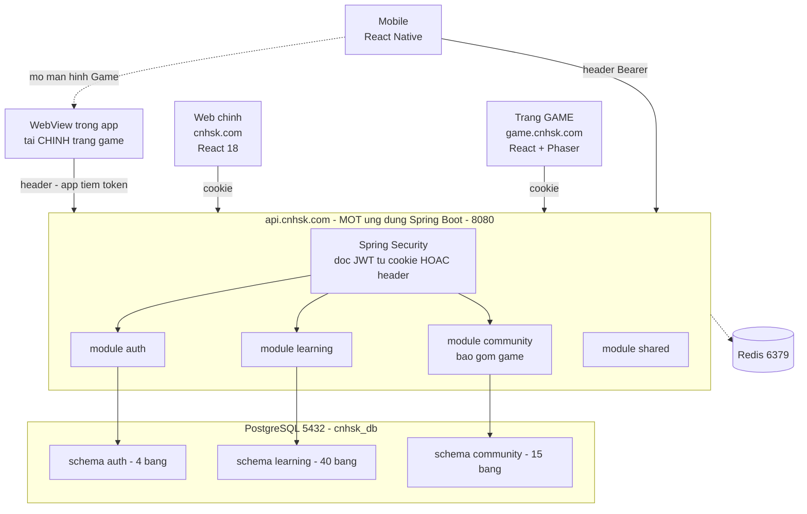
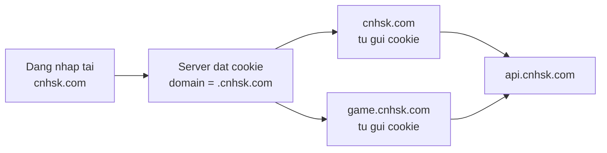
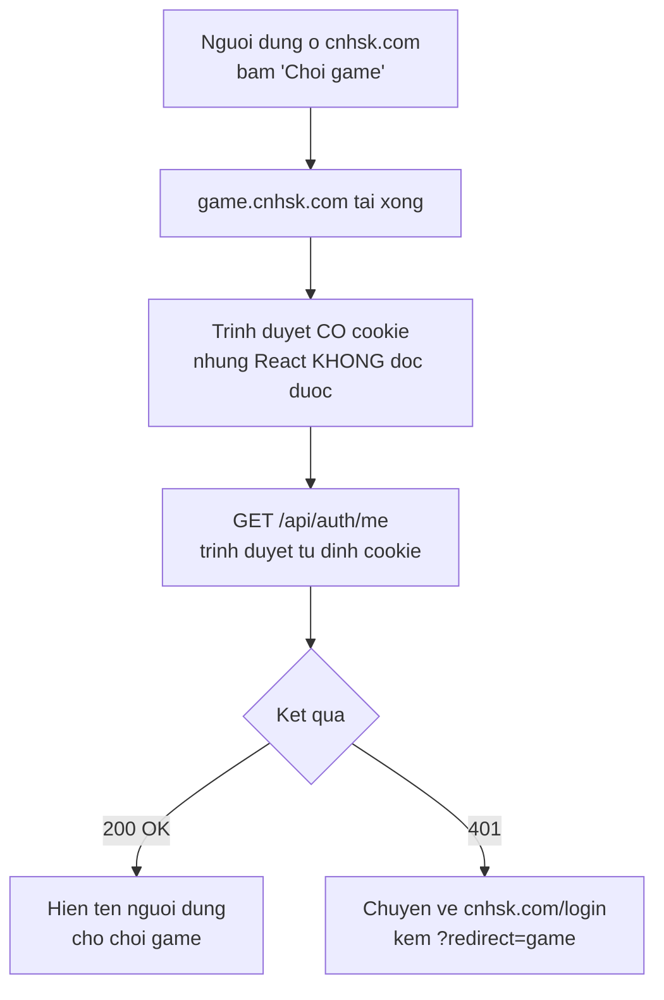
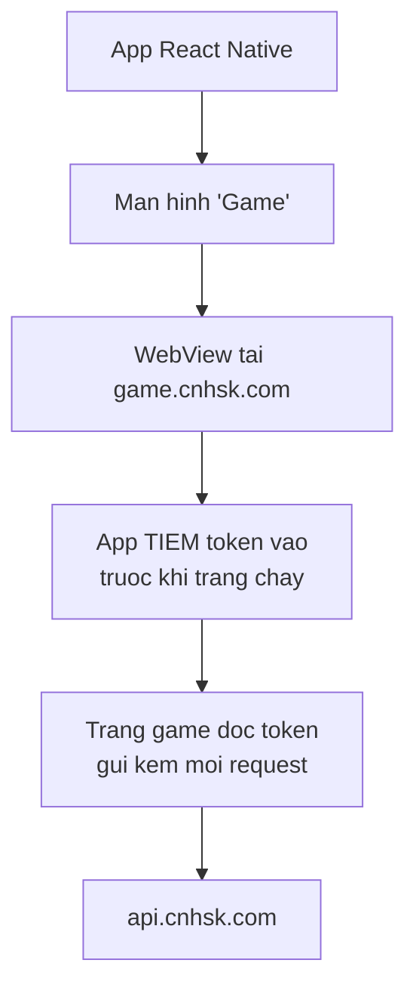
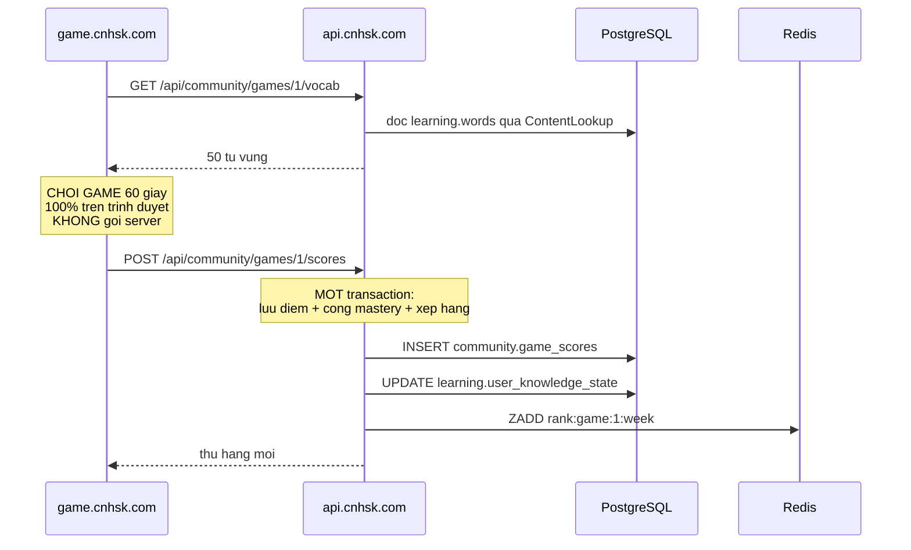

# Kiến trúc hệ thống — CNHSK

> **Ba frontend · Một backend Modular Monolith · 1 database · 1 Redis**
> Cập nhật 2026-10-06. Nội dung chính viết 2026-09-22 khi tách **trang game thành ứng dụng
> web riêng**; backend không đổi từ lúc đó.

## ⚠️ Hai chỗ trong file này đã lỗi thời

| Chỗ | File này ghi | Thực tế hiện nay | Nguồn đúng |
|---|---|---|---|
| Số schema | 3 (`auth`/`learning`/`community`) | **4** — thêm `shared` cho `audit_logs` | `database.md` §2 |
| Số bảng | 59 | **31** (26 MVP + 5 V2) | `database.md` §3 |

Sơ đồ ở mục 1 và ba bảng đối chiếu bên dưới **vẫn vẽ 3 schema** — chưa sửa vì việc đổi
`AC-04` của Hiến pháp cần RFC được cả nhóm duyệt (xem `database.md` §18).

**Mọi thứ khác trong file này còn đúng:** ba client, cookie `Domain=cnhsk.com`, CORS hai
tên miền, chống gian lận game, Redis sau ứng dụng.

## Thay đổi duy nhất

Bản 4 chốt backend là Modular Monolith. Bản 5 **không đụng gì tới backend** — chỉ tách tầng giao diện.

| | Bản 4 | **Bản 5** |
|---|---|---|
| Ứng dụng web | 1 (`cnhsk.com`) | **2** — thêm `game.cnhsk.com` |
| Mobile | 1 | 1 |
| **Backend** | **1 Spring Boot · 3 module** | **1 Spring Boot · 3 module** — giữ nguyên |
| Database | 1 DB · 3 schema · 59 bảng | ⚠️ **ĐÃ ĐỔI** — xem ghi chú đầu file |
| Redis | 1 | **giữ nguyên** |
| Cách chứa JWT | Chưa chốt | **Cookie `.cnhsk.com`** + header cho mobile |
| CORS | 1 tên miền | **2 tên miền** — ghi rõ từng cái |

> **Tách frontend KHÔNG phải tách microservice.** Trang game vẫn gọi về `api.cnhsk.com:8080` như web chính. Module `community` phục vụ cả ba client.

---

# 1 · Toàn cảnh hệ thống



## Ba client, một backend

| Client | Địa chỉ | Công nghệ | Xác thực |
|---|---|---|---|
| **Web chính** | `cnhsk.com` | React 18 | Cookie |
| **Trang game** | `game.cnhsk.com` | React + Phaser/PixiJS | **Cookie chung** |
| **Mobile** | App store | React Native | **Header `Authorization`** |
| **Mobile chơi game** | WebView → `game.cnhsk.com` | **Cùng trang game trên** | **Header** — app tiêm vào |
| Backend | `api.cnhsk.com` | Spring Boot 3.5.14 | — |

> **Backend không biết client nào đang gọi**, và không cần biết. Nó chỉ đọc JWT — từ cookie hay từ header đều được.

> **Trang game viết MỘT lần, chạy HAI nơi.** Web mở trực tiếp, mobile mở trong WebView. Không viết lại game bằng React Native — xem mục 2.3.

## Vì sao tách trang game

| Lý do | Giá trị thật |
|---|---|
| **Chia việc sạch** | Nhóm game làm repo riêng, không đụng code web chính, không chờ nhau |
| **Tự do công nghệ** | Dùng Phaser, PixiJS, Canvas — không ảnh hưởng web chính |
| **Web chính nhẹ hơn** | Thư viện game (Phaser ~1MB) không nằm trong gói tải của web chính |
| **Deploy riêng** | Sửa game không phải deploy lại web chính, và ngược lại |
| **Trình bày khi bảo vệ** | *"Kiến trúc multi-frontend, một API chung"* — hoàn toàn chuẩn |

## ⚠️ Lý do KHÔNG phải là giảm tải server

Đây là hiểu nhầm phổ biến, ghi rõ ở đây để nhóm không quyết định sai về sau.

**Game chạy trên trình duyệt người dùng, không chạy trên server.**

| Việc | Ai chịu tải |
|---|---|
| Chữ rơi 60 giây, 30 khung hình/giây | **Máy người chơi** |
| Đếm giờ, tính điểm, hiệu ứng | **Máy người chơi** |
| `POST` điểm khi kết thúc | Server — **1 request / 1 ván** |

So sánh tải thật:

| Hành động | Request tới server |
|---|---|
| Chơi một ván game 60 giây | **1** |
| Tra một từ trong từ điển | 1 |
| Làm một đề thi 40 câu | 3–5 |
| Mở trang cộng đồng, cuộn 3 lần | ~4 |

> **Chơi game tốn server ít hơn tra từ điển.** Tách frontend không giảm tải backend — nó giải quyết vấn đề **tổ chức code và công nghệ**, không phải vấn đề hiệu năng.
> Nếu sau này thật sự nặng, cái nặng sẽ là **bảng xếp hạng** (nhiều người xem cùng lúc) — mà xếp hạng đã ở Redis rồi.

---

# 2 · Đăng nhập chung — phần quan trọng nhất

Người dùng đăng nhập ở `cnhsk.com`, bấm sang `game.cnhsk.com` — **không được bắt đăng nhập lại**.

## Cách làm: cookie đặt ở tên miền cha



Cookie **có khai báo `Domain=cnhsk.com`** thì mọi tên miền phụ đều nhận được. Trình duyệt tự gửi kèm — không phải viết code truyền token.

> **Điều quyết định là CÓ khai báo `Domain` hay không**, chứ không phải dấu chấm đầu.
> Theo RFC 6265 mục 5.2.3, **dấu chấm đầu bị bỏ qua** — `Domain=.cnhsk.com` và
> `Domain=cnhsk.com` hoạt động **y hệt nhau**. Viết dấu chấm chỉ là thói quen cũ.
> **Nhưng nếu BỎ TRỐNG `Domain`** thì cookie chỉ thuộc về đúng máy chủ đặt nó —
> `game.cnhsk.com` sẽ **không nhận được**. Đây mới là lỗi cần tránh.

## Cấu hình cookie bắt buộc

```java
ResponseCookie.from("access_token", jwt)
    .domain("cnhsk.com")    // BAT BUOC khai bao -> moi ten mien phu deu nhan
    .path("/")
    .httpOnly(true)             // JavaScript KHONG doc duoc -> chong XSS
    .secure(true)               // chi gui qua HTTPS
    .sameSite("Lax")            // chong CSRF co ban
    .maxAge(Duration.ofHours(1))
    .build();
```

| Thuộc tính | Vì sao bắt buộc |
|---|---|
| `domain="cnhsk.com"` | **Bỏ trống** thì trang game **không nhận được** cookie |
| `httpOnly=true` | JavaScript không đọc được → kẻ tấn công XSS không lấy được token |
| `secure=true` | Chỉ gửi qua HTTPS → không bị nghe lén |
| `sameSite="Lax"` | Chống CSRF cơ bản — xem mục 2.2 |

> ⚠️ **Đánh đổi phải biết:** khai báo `Domain` khiến cookie gửi tới **mọi** tên miền phụ,
> kể cả những cái chưa tạo. Nếu sau này có `blog.cnhsk.com` do bên thứ ba quản lý,
> nó cũng nhận được cookie đăng nhập. Chỉ khai báo `Domain` khi thật sự cần chia sẻ.

## 2.1 Mobile không dùng cookie được

React Native **không có cookie như trình duyệt**. App phải gửi token qua header.

> **Backend bắt buộc đỡ CẢ HAI cách.** Đọc cookie trước, không có thì đọc header.

```java
// shared/security/JwtFilter.java
private String extractToken(HttpServletRequest request) {
    // 1. Uu tien cookie (web chinh + trang game)
    if (request.getCookies() != null) {
        for (Cookie c : request.getCookies()) {
            if ("access_token".equals(c.getName())) {
                return c.getValue();
            }
        }
    }
    // 2. Khong co cookie thi doc header (mobile)
    String header = request.getHeader("Authorization");
    if (header != null && header.startsWith("Bearer ")) {
        return header.substring(7);
    }
    return null;
}
```

| Client | Cách gửi | Vì sao |
|---|---|---|
| Web chính | Cookie | Trình duyệt tự gửi, an toàn nhất |
| Trang game | Cookie | Dùng chung cookie với web chính |
| **Mobile** | **Header `Authorization: Bearer ...`** | React Native không có cookie |
| **Trang game trong WebView** | **Header** — app tiêm vào | Xem mục 2.3 |

## 2.2 Trang game vừa tải xong thì làm gì — `HttpOnly` là con dao hai lưỡi

Đây là bước **bắt buộc** và hay bị quên.

`HttpOnly=true` chặn JavaScript đọc cookie — tốt cho bảo mật, nhưng nghĩa là **code React của trang game KHÔNG đọc được cookie**. Trang game không thể tự biết người dùng là ai.



**Trang game luôn bắt đầu bằng một lời gọi `GET /api/auth/me`.** Không có bước này thì trang game không biết hiển thị tên ai, và không biết người dùng đã đăng nhập chưa.

```tsx
// Trang game - chay khi vua tai xong
useEffect(() => {
  fetch(`${API}/api/auth/me`, { credentials: "include" })  // BAT BUOC co credentials
    .then(r => {
      if (r.status === 401) {
        window.location.href = `${WEB_CHINH}/login?redirect=${encodeURIComponent(location.href)}`;
        return null;
      }
      return r.json();
    })
    .then(user => user && setCurrentUser(user));
}, []);
```

> ⚠️ **`credentials: "include"` là bắt buộc** với mọi lời gọi `fetch` từ trang game. Thiếu nó thì trình duyệt **không gửi cookie** — và mọi request đều trả 401 dù đã đăng nhập.
> Đây là lỗi hay gặp nhất khi làm multi-frontend với cookie.

## 2.3 Mobile chơi game — WebView nhúng trang game

Tài liệu tính năng mục 5.6 ghi rõ Game Box là **MVP**, `Client: Web chính · Mobile`. Mobile **phải** chơi được game.

**Cách làm: app mở trang game trong WebView.** Viết game **một lần**, chạy cả web lẫn mobile.



| Cách | Công sức | Bảo trì | Đánh giá |
|---|---|---|---|
| **WebView nhúng trang game** | **~2–3 ngày** | **Một bản code** | ✅ **Chọn cách này** |
| Viết lại bằng React Native Skia | ~3–4 tuần | **Hai bản code** | ❌ Quá sức đồ án |
| Mở trình duyệt ngoài | ~1 giờ | Một bản | ❌ Đẩy người dùng ra khỏi app |
| Mobile không chơi game | 0 | — | ❌ Trái tài liệu tính năng 5.6 |

### ⚠️ KHÔNG truyền token qua URL

Cách sai mà nhiều người làm:

```
game.cnhsk.com/?token=eyJhbGciOiJIUzI1...
                     ^^^^^^^^^^^^^^^^^^^^^^
```

| Vì sao sai | Hậu quả |
|---|---|
| URL vào lịch sử WebView | Token còn lại sau khi đóng app |
| URL đi kèm header `Referer` | Lộ sang mọi tài nguyên bên ngoài trang gọi |
| URL vào log server | Token nằm trong file log, ai đọc log cũng thấy |

### ✅ Cách đúng: tiêm token trước khi trang chạy

`react-native-webview` có `injectedJavaScriptBeforeContentLoaded` — chạy **sau khi tạo document nhưng trước khi trang tải xong**. Token **không bao giờ** xuất hiện trong URL.

```tsx
// App React Native - man hinh Game
<WebView
  source={{ uri: "https://game.cnhsk.com" }}
  // Chay TRUOC khi trang game chay -> token san sang tu dau
  injectedJavaScriptBeforeContentLoaded={`
    window.__CNHSK_TOKEN__ = ${JSON.stringify(accessToken)};
    window.__CNHSK_PLATFORM__ = "mobile";
    true;
  `}
  onMessage={handleMessageFromGame}
/>
```

```ts
// Trang game - mot ham duy nhat lay token
function getAuthHeaders(): HeadersInit {
  const token = (window as any).__CNHSK_TOKEN__;
  return token ? { Authorization: `Bearer ${token}` } : {};
}

// Dung cho MOI loi goi API
fetch(`${API}/api/community/games/1/scores`, {
  method: "POST",
  credentials: "include",        // web: gui cookie
  headers: { ...getAuthHeaders(), "Content-Type": "application/json" },  // mobile: gui header
  body: JSON.stringify(result),
});
```

> **Một đoạn code chạy được cả hai nơi.** Trên web `__CNHSK_TOKEN__` không tồn tại → dùng cookie. Trong WebView có token → dùng header. **Không cần viết hai nhánh logic.**

### Token hết hạn giữa lúc chơi

Token 1 giờ có thể hết hạn khi đang chơi. App phải làm mới và báo cho WebView:

```tsx
// App gui token moi xuong WebView
webViewRef.current?.postMessage(JSON.stringify({
  type: "TOKEN_REFRESHED",
  token: newAccessToken
}));
```

```ts
// Trang game nhan token moi
window.addEventListener("message", (e) => {
  const msg = JSON.parse(e.data);
  if (msg.type === "TOKEN_REFRESHED") {
    (window as any).__CNHSK_TOKEN__ = msg.token;
  }
});
```

> **Đơn giản hơn cho đồ án:** nếu thấy phức tạp, app **làm mới token ngay trước khi mở WebView**. Một ván game chỉ 60 giây — token 1 giờ thừa sức. Chỉ cần xử lý `postMessage` nếu người dùng chơi liên tục trên một giờ.

### Ba việc app phải làm

| # | Việc | Vì sao |
|---|---|---|
| 1 | Tiêm token qua `injectedJavaScriptBeforeContentLoaded` | Không dùng URL |
| 2 | Làm mới token trước khi mở WebView | Tránh hết hạn giữa ván |
| 3 | Bắt `onMessage` để nhận "đã chơi xong" | Đóng WebView, cập nhật màn hình chính |

## 2.4 ⚠️ Cookie mở ra rủi ro CSRF — phải phòng

Đây là **cái giá** của việc chọn cookie thay vì header.

**Vấn đề:** cookie được trình duyệt gửi **tự động** với mọi request tới `cnhsk.com`. Nếu người dùng đang đăng nhập mà mở một trang web độc hại, trang đó có thể gửi request tới API của bạn — và **cookie vẫn được gửi kèm**.

| | Header `Authorization` | **Cookie** |
|---|---|---|
| Bị XSS đọc trộm token | ⚠️ Có (nếu lưu localStorage) | ✅ Không (`HttpOnly`) |
| Bị CSRF | ✅ Không (phải tự gắn header) | ⚠️ **Có — phải phòng** |

**Ba lớp phòng CSRF:**

| # | Cách | Ghi chú |
|---|---|---|
| 1 | `SameSite=Lax` | Chặn CSRF từ **tên miền khác**. Trang lạ gửi `POST` thì cookie **không** được gửi kèm |
| 2 | CORS ghi rõ từng tên miền | Không dùng `*` — xem mục 3 |
| 3 | CSRF token cho thao tác ghi | Spring Security có sẵn. **Bắt buộc cho nhóm bảng dính tiền thật** |

## ⚠️ `SameSite=Lax` KHÔNG chặn được tên miền phụ của chính mình

Điểm này quan trọng và hay bị bỏ sót.

`SameSite` tính theo **site** (registrable domain / eTLD+1), **không** theo tên miền đầy đủ:

| Từ → tới | SameSite coi là | Cookie có gửi không |
|---|---|---|
| `game.cnhsk.com` → `api.cnhsk.com` | **Same-site** | ✅ Có — **kiến trúc này chạy được** |
| `cnhsk.com` → `api.cnhsk.com` | **Same-site** | ✅ Có |
| `trang-la.com` → `api.cnhsk.com` | Cross-site | ❌ `Lax` chặn `POST` |

**Hai mặt của cùng một điều:**

- ✅ **Mặt tốt:** đây chính là lý do trang game gọi API được. Nếu `SameSite` tính theo tên miền đầy đủ thì kiến trúc này không chạy.
- ⚠️ **Mặt xấu:** nếu **bất kỳ** tên miền phụ nào bị chiếm (`blog.cnhsk.com`, một trang demo cũ, một subdomain bỏ quên), kẻ tấn công từ đó **vượt qua được `SameSite`**.

> **Vì vậy `SameSite=Lax` là lớp phòng thứ nhất, KHÔNG phải lớp duy nhất.**
> Với các thao tác đổi tiền (nhập thẻ, trừ điểm, mua gói) **bắt buộc bật CSRF token của Spring Security**. Đây là nhóm bảng có tiền thật — không tiết kiệm ở chỗ này.
> Ngoài ra: **đừng trỏ tên miền phụ nào tới dịch vụ bên thứ ba** mà nhóm không kiểm soát.

---

# 3 · CORS — chỗ hay mất cả buổi để sửa

Backend giờ phục vụ **hai tên miền web**. Cấu hình CORS sai thì đăng nhập không chạy, và thông báo lỗi của trình duyệt rất khó hiểu.

```java
// shared/config/SecurityConfig.java
@Bean
CorsConfigurationSource corsConfigurationSource() {
    CorsConfiguration config = new CorsConfiguration();

    // GHI RO TUNG TEN MIEN - KHONG dung "*"
    config.setAllowedOrigins(List.of(
        "https://cnhsk.com",
        "https://game.cnhsk.com"
    ));
    config.setAllowedMethods(List.of("GET", "POST", "PUT", "DELETE", "OPTIONS"));
    config.setAllowedHeaders(List.of("*"));

    // BAT BUOC de trinh duyet gui cookie kem request
    config.setAllowCredentials(true);

    UrlBasedCorsConfigurationSource source = new UrlBasedCorsConfigurationSource();
    source.registerCorsConfiguration("/**", config);
    return source;
}
```

## Hai lỗi kinh điển

| Lỗi | Hậu quả | Cách sửa |
|---|---|---|
| Dùng `allowedOrigins("*")` cùng `allowCredentials(true)` | **Trình duyệt chặn thẳng.** Không gửi cookie, báo lỗi khó hiểu | Ghi rõ từng tên miền |
| Quên `allowCredentials(true)` | Request chạy nhưng **cookie không được gửi** → luôn báo chưa đăng nhập | Thêm dòng đó |

> ⚠️ **Đây là hai lỗi tốn thời gian nhất khi làm multi-frontend.** Ghi ra đây để nhóm khỏi mắc.

## WebView KHÔNG cần khai báo thêm origin

Câu hỏi hay gặp: *"WebView trong app có phải thêm vào `allowedOrigins` không?"*

**Không.** WebView tải `https://game.cnhsk.com`, nên origin của nó **vẫn là** `game.cnhsk.com` — đã khai báo rồi. Không thêm gì cả.

> ⚠️ **Ngoại lệ:** nếu app tải HTML từ file cục bộ trong máy (`file://` hoặc `about:blank`) thì origin là `null` và CORS **sẽ chặn**. Kiến trúc này không làm vậy — WebView luôn tải từ URL thật, nên không gặp vấn đề.

## Trong WebView, cookie và header có thể cùng tồn tại

WebView **có** lưu cookie (nó là trình duyệt thu nhỏ). Nên một request từ WebView có thể mang **cả hai**:

```
Cookie: access_token=...        ← neu nguoi dung tung dang nhap trong WebView
Authorization: Bearer ...       ← app tiem vao
```

**`JwtFilter` đọc cookie trước** (mục 2.1), nên cookie cũ trong WebView sẽ **che mất** token app vừa tiêm — và nếu cookie đó đã hết hạn thì người dùng bị báo chưa đăng nhập dù app có token tốt.

| Cách xử lý | Đánh giá |
|---|---|
| **App xoá cookie của WebView trước khi mở** | ✅ Đơn giản, rõ ràng — dùng `CookieManager.clearAll()` |
| Đảo thứ tự: đọc header trước cookie | ⚠️ Làm được nhưng đổi hành vi của cả web |
| Dùng tên cookie khác cho WebView | ❌ Phức tạp không cần thiết |

> **Khuyến nghị:** app gọi `CookieManager.clearAll()` trước khi mở WebView. Mobile chỉ dùng header, không cần cookie — xoá đi cho sạch.

## Môi trường phát triển cục bộ

Lúc dev không có tên miền thật. Dùng `localhost` với cổng khác nhau:

| Client | Địa chỉ dev | Ghi chú |
|---|---|---|
| Web chính | `http://localhost:5173` | Vite mặc định |
| Trang game | `http://localhost:5174` | Cổng khác |
| Backend | `http://localhost:8080` | — |

> ✅ **Tin tốt: cookie KHÔNG phân biệt cổng.** `localhost:5173` và `localhost:5174` **dùng chung cookie của `localhost`** — nên lúc dev không cần làm gì đặc biệt để hai trang chia sẻ phiên đăng nhập.
> Lúc dev đặt cookie **bỏ trống `domain`** (vì `localhost` không có tên miền phụ) và `secure=false` (vì dev dùng HTTP).
>
> ⚠️ **Nhưng cổng vẫn tính là origin khác đối với CORS.** Nên `localhost:5174` vẫn phải khai báo trong `allowedOrigins` — cookie thì chung, CORS thì không.

```yaml
# application.yaml - moi truong dev
app:
  cookie:
    domain:              # de trong khi dev
    secure: false        # dev dung HTTP
  cors:
    allowed-origins:
      - http://localhost:5173
      - http://localhost:5174
```

```yaml
# application-prod.yaml
app:
  cookie:
    domain: .cnhsk.com
    secure: true
  cors:
    allowed-origins:
      - https://cnhsk.com
      - https://game.cnhsk.com
```

---

# 4 · Trang game gọi những API nào

Trang game **không có backend riêng**. Nó gọi đúng các endpoint của module `community`.

| Việc | Endpoint | Thuộc module |
|---|---|---|
| Lấy danh sách game | `GET /api/community/games` | community |
| Lấy từ vựng cho game | `GET /api/community/games/{id}/vocab` | community → gọi `ContentLookup` |
| **Gửi điểm khi chơi xong** | `POST /api/community/games/{id}/scores` | community |
| Xem bảng xếp hạng | `GET /api/community/rankings?game={id}` | community |
| Thông tin người chơi | `GET /api/auth/me` | auth |

## Luồng một ván game



> **Toàn bộ 60 giây chơi game: KHÔNG có request nào tới server.** Chỉ hai lời gọi — lấy từ vựng lúc bắt đầu, gửi điểm lúc kết thúc.

## Cộng mastery vẫn trong một transaction

Bạn đã chốt **giữ tính năng cộng mastery** (mục 5.6 tài liệu tính năng). Việc tách frontend **không ảnh hưởng gì** — backend vẫn làm trong một transaction như bản 4:

```java
// community/game/GameScoreService.java
@Transactional
public RankResult submitScore(Long userId, Long gameId, GameResult result) {
    gameScoreRepository.save(...);                              // community
    masteryUpdater.applyGameResult(userId, result.kpIds(), ...); // learning - cung transaction
    return rankingService.updateRank(userId, result.score());
}
```

> Đây là thứ **sẽ mất** nếu tách game thành backend service riêng. Giữ backend monolith nên vẫn còn.

---

# 5 · Chống gian lận điểm game

Trang game chạy trên trình duyệt — người dùng **sửa được mọi thứ** bằng DevTools. Đây là rủi ro có thật, và tách frontend không làm nó nặng thêm, nhưng phải xử lý.

| Nguy cơ | Cách phòng |
|---|---|
| Gửi thẳng `POST scores` với điểm 999999 | **Giới hạn trần điểm** theo từng game ở server |
| Chơi 1 giây rồi báo điểm tối đa | **Kiểm thời gian**: `answered_at − served_at` phải hợp lý |
| Gửi điểm liên tục nhiều lần | **Giới hạn tần suất**: tối đa N ván/giờ mỗi tài khoản |
| Sửa danh sách từ đã gặp để cộng mastery sai | Server chỉ cộng mastery cho **từ đã phát ở bước lấy từ vựng** |

```java
// Server LUON kiem, khong tin client
if (result.score() > game.maxPossibleScore()) {
    throw new ApiException("Diem vuot tran cho phep");
}
if (Duration.between(servedAt, Instant.now()).getSeconds() < game.minDurationSeconds()) {
    throw new ApiException("Thoi gian choi khong hop le");
}
```

> **Nguyên tắc số 7 của dự án vẫn áp dụng:** chấm điểm ở server, không ở client. Game tính điểm trên trình duyệt để mượt, nhưng **server phải kiểm lại tính hợp lý** trước khi lưu.
> Đây không phải bảo mật tuyệt đối — chỉ cần đủ để bảng xếp hạng không vô nghĩa.

---

# 6 · Giữ giao diện đồng nhất giữa hai trang

Hai ứng dụng React riêng dễ bị lệch màu, lệch font, lệch nút bấm — người dùng thấy như hai sản phẩm khác nhau.

| Cách | Công sức | Khuyến nghị |
|---|---|---|
| **Chia sẻ biến CSS** (design token) | Thấp | ✅ **Làm cái này** |
| Thư viện component dùng chung (npm package riêng) | Cao | ❌ Quá sức đồ án |
| Mỗi trang tự làm | Không | ❌ Sẽ lệch ngay |

**Cách làm rẻ nhất:** một file CSS chung, cả hai trang cùng dùng.

```css
/* design-tokens.css - copy sang ca hai project */
:root {
  --brand:        #C1432E;
  --brand-dark:   #9A3525;
  --ink:          #1C1917;
  --paper:        #F7F4EE;
  --radius:       10px;
  --font-sans:    "Be Vietnam Pro", system-ui, sans-serif;
}
```

> **Đồ án thì copy file là đủ.** Đừng dựng npm package riêng — tốn thời gian hơn giá trị nó mang lại.

Ngoài ra cần **nút điều hướng qua lại** rõ ràng ở cả hai trang: *"Về trang chính"* và *"Chơi game"*.

---

# 7 · Backend — KHÔNG đổi gì

Đây là phần quan trọng nhất của bản 5: **mọi thứ ở bản 4 giữ nguyên**.

| Thành phần bản 4 | Bản 5 |
|---|---|
| 1 ứng dụng Spring Boot, cổng 8080 | ✅ Giữ nguyên |
| 4 module `auth` `learning` `community` `shared` | ✅ Giữ nguyên |
| 3 schema, 59 bảng, tài khoản `svc_app` | ⚠️ **ĐÃ ĐỔI** → 4 schema · 31 bảng · vẫn 1 `svc_app` |
| 3 interface `UserLookup` `MasteryUpdater` `ContentLookup` | ✅ Giữ nguyên |
| 8 luật ArchUnit | ✅ Giữ nguyên |
| Redis | ✅ Giữ nguyên |
| Game nằm trong module `community` | ✅ Giữ nguyên |

**Chỉ hai file backend cần sửa:**

| File | Sửa gì |
|---|---|
| `shared/config/SecurityConfig.java` | CORS thêm tên miền game · `allowCredentials(true)` · CSRF cho thao tác ghi |
| `shared/security/JwtFilter.java` | Đọc token từ **cookie hoặc header** |

> **Game vẫn là module `community`, không phải service riêng.** Trang game chỉ là một *client* khác của cùng backend đó.

---

# 8 · Thuận lợi

| # | Thuận lợi | Giá trị thật |
|---|---|---|
| 1 | **Chia việc sạch** | Nhóm game làm repo riêng, không đụng code ai |
| 2 | **Tự do chọn công nghệ game** | Phaser, PixiJS, Canvas — không ảnh hưởng web chính |
| 3 | **Web chính nhẹ hơn** | Thư viện game không nằm trong gói tải của web chính |
| 4 | **Deploy độc lập** | Sửa game không deploy lại web chính |
| 5 | **Backend không đổi** | Giữ nguyên toàn bộ công đã làm ở bản 4 |
| 6 | **Cookie `HttpOnly` an toàn hơn** | JavaScript không đọc được token → chống XSS |
| 7 | **Đăng nhập một lần** | Người dùng không biết có hai trang |
| 8 | **Trình bày tốt khi bảo vệ** | Multi-frontend + một API chung là kiến trúc chuẩn |

---

# 9 · Rủi ro

| # | Rủi ro | Mức | Cách phòng |
|---|---|---|---|
| 1 | **CORS cấu hình sai** | 🔴 Cao | Ghi rõ từng tên miền · `allowCredentials(true)` · mục 3 |
| 2 | **CSRF do dùng cookie** | 🔴 Cao | `SameSite=Lax` + CSRF token cho thao tác đổi tiền · mục 2.2 |
| 3 | **Gian lận điểm game** | 🟠 Vừa | Trần điểm · kiểm thời gian · giới hạn tần suất · mục 5 |
| 4 | **Token lộ qua URL khi mở WebView** | 🔴 Cao | **Tiêm qua `injectedJavaScriptBeforeContentLoaded`**, không dùng `?token=` · mục 2.3 |
| 5 | **Cookie cũ trong WebView che token app** | 🟠 Vừa | App gọi `CookieManager.clearAll()` trước khi mở WebView · mục 3 |
| 6 | Quên `credentials: "include"` khi `fetch` | 🟠 Vừa | Mọi request từ trang game đều phải có · mục 2.2 |
| 7 | Giao diện hai trang lệch nhau | 🟠 Vừa | Chia sẻ file design token · mục 6 |
| 8 | Token hết hạn giữa lúc chơi | 🟡 Thấp | Làm mới trước khi mở WebView · mục 2.3 |
| 9 | Thêm một nơi deploy | 🟡 Thấp | Vercel/Netlify deploy web tĩnh rất nhẹ |
| 10 | Dev phải chạy hai server frontend | 🟡 Thấp | Cookie không phân biệt cổng → dev dễ |
| 11 | Người dùng lạc giữa hai trang | 🟡 Thấp | Nút điều hướng rõ ràng ở cả hai |

> **Ba rủi ro đầu tiên (1, 2, 4) phải làm đúng ngay từ đầu** — đều liên quan tới xác thực, sửa sau rất tốn. Từ số 9 trở đi chỉ là bất tiện nhỏ.

---

# 10 · Trình bày khi bảo vệ

> *"Hệ thống có **ba client**: web chính, trang game và ứng dụng mobile, cùng gọi về **một backend Modular Monolith**.*
>
> *Trang game tách riêng vì hai lý do: nhóm game cần **tự do chọn thư viện đồ hoạ** (Phaser) mà không làm nặng gói tải của web chính, và để **chia việc song song** giữa các thành viên.*
>
> *Ba client dùng chung phiên đăng nhập qua **cookie đặt ở tên miền cha** `cnhsk.com`, với `HttpOnly` chống XSS và `SameSite=Lax` chống CSRF. Mobile không dùng được cookie nên backend đọc token từ **cả cookie lẫn header**.*
>
> ***Mobile chơi game bằng WebView nhúng chính trang game đó** — viết game một lần, chạy cả web lẫn mobile. App tiêm token vào WebView trước khi trang chạy, **không truyền qua URL** để token không lọt vào lịch sử duyệt và log server."*

| Câu hỏi có thể gặp | Trả lời |
|---|---|
| *"Tách game ra có phải microservice không?"* | Không. Tách **frontend**, backend vẫn là một monolith. Game là module `community` |
| *"Sao không tách backend game luôn?"* | Game chơi một mình, backend chỉ có một endpoint. Tách sẽ mất transaction cộng mastery mà không được gì |
| *"Đăng nhập hai trang thế nào?"* | Cookie tên miền cha. Đăng nhập một lần, cả hai trang nhận |
| *"Người dùng sửa điểm game được không?"* | Sửa được ở client, nhưng server kiểm trần điểm và thời gian trước khi lưu |
| *"Mobile chơi game thế nào?"* | **WebView nhúng chính trang game đó.** Viết game một lần, chạy cả web lẫn mobile |
| *"Sao không viết game riêng cho mobile?"* | Phải bảo trì hai bản code cho cùng một game. WebView đủ mượt cho 5 game chơi một mình |
| *"Token truyền vào WebView thế nào?"* | Tiêm qua `injectedJavaScriptBeforeContentLoaded` — **không** qua URL, vì URL lọt vào lịch sử và log |
| *"Tách ra có giảm tải server không?"* | **Không** — game chạy trên trình duyệt. Tách để tổ chức code, không phải để giảm tải |

> Câu cuối quan trọng: **trả lời trung thực** là điểm mạnh. Nói "để giảm tải" là sai và thầy có thể hỏi tiếp.

---

# 11 · Thứ tự triển khai

| Bước | Việc | Ghi chú |
|---|---|---|
| 1 | Hạ tầng + khung backend + ArchUnit | ✅ **đã xong** |
| 2 | Module `auth`: đăng ký, đăng nhập | Cấp JWT |
| 3 | **`JwtFilter` đọc cookie + header** | Làm ngay khi có auth, đừng để sau |
| 4 | **`SecurityConfig`: CORS hai tên miền + CSRF** | Cùng lúc với bước 3 |
| 5 | Web chính — khung trang, đăng nhập | Xác nhận cookie chạy |
| 6 | Module `learning` | Phần lớn nhất — 40 bảng |
| 7 | Module `community`: blog, quiz, xếp hạng | Kèm endpoint game |
| 8 | **Trang game — project React riêng** | Khi API game đã chạy. Dùng `getAuthHeaders()` ngay từ đầu |
| 9 | Kiểm đăng nhập chung giữa hai trang | **Nghiệm thu: đăng nhập ở web chính, sang game không phải nhập lại** |
| 10 | **Mobile: WebView nhúng trang game** | Tiêm token qua `injectedJavaScriptBeforeContentLoaded` |
| 11 | Kiểm mobile chơi game | **Nghiệm thu: mở app → vào Game → chơi → điểm lưu đúng tài khoản** |
| 12 | Chống gian lận điểm | Trước khi mở bảng xếp hạng công khai |

> **Bước 3 và 4 đi cùng nhau, và làm sớm.** Sửa cách xác thực sau khi đã viết 20 màn hình là việc rất tốn.

---

# 12 · Việc cần quyết

| # | Việc | Gợi ý |
|---|---|---|
| 1 | Tên miền thật là gì? | Cần chốt trước khi cấu hình cookie |
| 2 | Deploy frontend ở đâu? | Vercel/Netlify — web tĩnh, miễn phí, hỗ trợ tên miền phụ |
| 3 | Thư viện game dùng gì? | Phaser 3 (đầy đủ) hoặc Canvas API thuần (nhẹ) |
| 4 | Trần điểm mỗi game là bao nhiêu? | Cần khi làm chống gian lận |
| 5 | Repo riêng hay monorepo? | Đồ án: **hai repo riêng** đơn giản hơn |
| 6 | Hạn token bao lâu? | 1 giờ access · 30 ngày refresh |

---

# Phụ lục · Đối chiếu bản 4 → bản 5

| Thứ của bản 4 | Bản 5 |
|---|---|
| 1 web + 1 mobile | **2 web + 1 mobile** |
| Backend Modular Monolith | ✅ **Giữ nguyên hoàn toàn** |
| 3 schema · 59 bảng | ⚠️ **ĐÃ ĐỔI** → 4 schema · 31 bảng |
| 4 module · 3 interface · 8 luật ArchUnit | ✅ Giữ nguyên |
| Game trong module `community` | ✅ Giữ nguyên |
| Redis | ✅ Giữ nguyên |
| JWT chưa chốt cách chứa | → **Cookie `.cnhsk.com`** + header cho mobile |
| CORS một tên miền | → **Hai tên miền**, ghi rõ từng cái |
| — | 🆕 Chống CSRF (`SameSite` + CSRF token) |
| — | 🆕 Chống gian lận điểm game |
| — | 🆕 Chia sẻ design token giữa hai trang |
| — | 🆕 **Trang game gọi `/api/auth/me` khi tải xong** (vì `HttpOnly`) |
| — | 🆕 **Mobile chơi game qua WebView** — viết game một lần |
| — | 🆕 **Tiêm token vào WebView**, không truyền qua URL |
