# WBS & Estimate — CNHSK

> 2026-09-25 · Nhóm 6 người · 11–12 tuần · **20 giờ/tuần/người**
> Dựa trên: `feature-tree.md` (33 tính năng) · `kien-truc.md` · `database.md` (31 bảng)

## Nhóm dự án

| Tên | Vai trò | Mảng chính |
|---|---|---|
| **Trí** | Leader | Quản lý · Backend auth/thanh toán · ~30% thời gian lo điều phối |
| **Tường** | Backend | API học tập, đề thi, mastery |
| **Đạt** | Backend | API từ điển, AI, admin, game |
| **Xuân Huy** | Frontend web | React — học tập, thi, tiến độ |
| **Quốc Huy** | Mobile | React Native — khung, auth, học tập |
| **Dũng** | Mobile | React Native — thi, tiến độ, WebView game |

> **Trang game** (`game.cnhsk.com`) do Đạt + Xuân Huy làm chung ở giai đoạn 4.
> **Cuốn chiếu:** backend xong API nào → web làm màn hình đó → mobile bám theo sau 1–2 tuần.

---

# 1 · WBS là gì và đọc thế nào

**Work Breakdown Structure** — chia dự án thành từng mẩu việc nhỏ đến mức **giao được cho một người và ước tính được thời gian**.

## Ba quy tắc

| # | Quy tắc | Ví dụ |
|---|---|---|
| 1 | **Ghi danh từ, không ghi động từ** | ❌ "Làm đăng nhập" → ✅ "Chức năng đăng nhập hoàn chỉnh" |
| 2 | **Mỗi lá có sản phẩm kiểm tra được** | "API trả 200 kèm cookie, sai mật khẩu trả 401" |
| 3 | **Chia đến khi ước tính được thì dừng** | Lá 8–40 giờ. Lớn hơn → chia tiếp. Nhỏ hơn → gộp lại |

> **Vì sao dùng danh từ?** Danh từ thì kiểm tra được *xong hay chưa*. Động từ thì mãi mãi "đang làm".

## Quy tắc 100%

Con phải **cộng đủ bằng** cha. Nếu 3.1 + 3.2 + 3.3 chưa bằng toàn bộ nhóm 3, nghĩa là **thiếu việc** — và việc thiếu đó vẫn phải làm, chỉ là không ai ước tính.

---

# 2 · Cây WBS

## Sơ đồ hai tầng

```mermaid
flowchart TB
    R["1.0 CNHSK<br/>1.288 gio-nguoi"]

    R --- N1["1.1 Quan ly du an<br/>48h"]
    R --- N2["1.2 Ha tang nen tang<br/>88h"]
    R --- N3["1.3 Backend tai khoan<br/>106h"]
    R --- N4["1.4 Backend hoc tap<br/>131h"]
    R --- N5["1.5 Backend thi<br/>109h"]
    R --- N6["1.6 Backend AI - CD - Admin<br/>166h"]
    R --- N7["1.7 Web giao dien<br/>255h"]
    R --- N8["1.8 Trang game rieng<br/>90h"]
    R --- N9["1.9 Mobile<br/>160h"]
    R --- N10["1.10 Kiem thu - ban giao<br/>135h"]

    N1 --- A1["1.1.4 WBS - Estimate - Trello  10h"]
    N1 --- A2["1.1.5 Bao cao tien do tuan  17h"]
    N1 --- A3["1.1.6 Ho so bao ve - slide  21h"]

    N2 --- B1["1.2.3 Migration V1-V17  38h"]
    N2 --- B2["1.2.4-5 Bao mat CORS - CSRF - JWT  26h"]
    N2 --- B3["1.2.6-7 Xu ly loi - deploy  24h"]

    N3 --- C1["1.3.1-2 Dang nhap - 4 role  47h"]
    N3 --- C2["1.3.3 Goi dich vu  19h"]
    N3 --- C3["1.3.4-5 The nap - so cai  40h"]

    N4 --- D1["1.4.1-2 Tu dien - chu de  46h"]
    N4 --- D2["1.4.3-4 Mastery FSRS - lo trinh  55h"]
    N4 --- D3["1.4.5-6 Thong ke - nhac hoc  30h"]

    N5 --- E1["1.5.1 Kho cau hoi - nhan KT  23h"]
    N5 --- E2["1.5.2-3 Lam bai - cham diem  46h"]
    N5 --- E3["1.5.4-5 Phan tich loi - cham thue  40h"]

    N6 --- F1["1.6.1-2 Tro ly AI - sinh cau hoi  50h"]
    N6 --- F2["1.6.3-5 Blog - quiz - xep hang  57h"]
    N6 --- F3["1.6.6-8 Game API - nhap data - admin  59h"]

    N7 --- G1["1.7.1-3 Khung - dang nhap - tra cuu  55h"]
    N7 --- G2["1.7.4-5 Hoc tu - luyen viet  40h"]
    N7 --- G3["1.7.6-8 Thi - loi sai - tien do  61h"]
    N7 --- G4["1.7.9-11 So tay - AI chat - thanh toan  51h"]
    N7 --- G5["1.7.12-13 Cong dong - quan tri  48h"]

    N8 --- H1["1.8.1-2 Project rieng - xac thuc  24h"]
    N8 --- H2["1.8.3-6 Bon game  56h"]
    N8 --- H3["1.8.7 Gui diem - xep hang  10h"]

    N9 --- I1["1.9.1-2 Khung app - dang nhap  38h"]
    N9 --- I2["1.9.3-4 Tra cuu - luyen viet  48h"]
    N9 --- I3["1.9.5-6 Lam de thi - tien do  44h"]
    N9 --- I4["1.9.7-8 WebView game - thong bao  30h"]

    N10 --- J1["1.10.1-3 Unit - tich hop - da nen tang  69h"]
    N10 --- J2["1.10.4 Sua loi tich hop  36h"]
    N10 --- J3["1.10.5-6 Du lieu demo - ban giao  30h"]
```



> **33 hộp cấp 2 gom đủ 66 đầu việc.** Ví dụ `1.3.4–5` gom hai đầu việc 1.3.4 và 1.3.5.
> Bản vẽ đẹp hơn (tải được SVG/PNG để chèn slide): xem trang trình chiếu sơ đồ WBS.

## Cây đầy đủ 66 đầu việc

```
1.0 CNHSK — Nền tảng học tiếng Trung cho người Việt
│
├── 1.1 Quản lý dự án                                  [Trí]
│   ├── 1.1.1 Tài liệu đặc tả (33 tính năng)           ✅ XONG
│   ├── 1.1.2 Tài liệu kiến trúc (bản 5)               ✅ XONG
│   ├── 1.1.3 Tài liệu CSDL (31 bảng) + ERD            ✅ XONG
│   ├── 1.1.4 WBS + Estimate + bảng Trello             ← đang làm
│   ├── 1.1.5 Báo cáo tiến độ hàng tuần
│   └── 1.1.6 Hồ sơ bảo vệ + slide
│
├── 1.2 Hạ tầng và nền tảng                            [Trí + Tường]
│   ├── 1.2.1 Docker: PostgreSQL + Redis               ✅ XONG
│   ├── 1.2.2 Project Spring Boot + ArchUnit           ✅ XONG
│   ├── 1.2.3 Migration V1–V4 (31 bảng)
│   ├── 1.2.4 SecurityConfig: CORS 2 tên miền + CSRF
│   ├── 1.2.5 JwtFilter: đọc cookie HOẶC header
│   ├── 1.2.6 Xử lý lỗi chung + chuẩn response
│   └── 1.2.7 Deploy môi trường staging
│
├── 1.3 Backend — Tài khoản và thanh toán              [Trí]
│   ├── 1.3.1 Đăng ký · đăng nhập · JWT
│   ├── 1.3.2 Phân quyền 4 role
│   ├── 1.3.3 Gói dịch vụ và đăng ký gói
│   ├── 1.3.4 Thẻ nạp và đổi điểm
│   └── 1.3.5 Sổ cái giao dịch
│
├── 1.4 Backend — Học tập                              [Tường]
│   ├── 1.4.1 API từ điển (chữ · từ · ngữ pháp)
│   ├── 1.4.2 Cây chủ đề và từ theo chủ đề
│   ├── 1.4.3 Mastery + FSRS
│   ├── 1.4.4 Lộ trình và cổng 90%
│   ├── 1.4.5 Thống kê tiến độ
│   └── 1.4.6 Nhắc lịch học
│
├── 1.5 Backend — Thi và luyện tập                     [Tường]
│   ├── 1.5.1 Kho câu hỏi + nhãn kiến thức
│   ├── 1.5.2 Đề thi thử và làm bài
│   ├── 1.5.3 Chấm điểm server-side
│   ├── 1.5.4 Phân tích lỗi sai
│   └── 1.5.5 Chấm thuê (teacher)
│
├── 1.6 Backend — AI, cộng đồng, admin                 [Đạt]
│   ├── 1.6.1 Trợ lý ảo AI hỏi đáp
│   ├── 1.6.2 AI sinh câu hỏi + duyệt
│   ├── 1.6.3 Blog + kiểm duyệt
│   ├── 1.6.4 Quiz theo chủ đề
│   ├── 1.6.5 Xếp hạng (Redis Sorted Set)
│   ├── 1.6.6 API game + chống gian lận
│   ├── 1.6.7 Nhập dữ liệu của thầy
│   └── 1.6.8 Trang quản trị (API)
│
├── 1.7 Web — Giao diện chính                          [Xuân Huy]
│   ├── 1.7.1 Khung React + routing + theme
│   ├── 1.7.2 Đăng nhập · đăng ký · hồ sơ
│   ├── 1.7.3 Tra cứu và dịch
│   ├── 1.7.4 Học từ theo chủ đề
│   ├── 1.7.5 Luyện viết chữ (hanzi-writer)
│   ├── 1.7.6 Làm đề thi + kết quả
│   ├── 1.7.7 Phân tích lỗi sai
│   ├── 1.7.8 Tiến độ và biểu đồ
│   ├── 1.7.9 Sổ tay + flashcard
│   ├── 1.7.10 Chat AI (xuyên suốt)
│   ├── 1.7.11 Thanh toán và nhập thẻ
│   ├── 1.7.12 Cộng đồng (blog · quiz · xếp hạng)
│   └── 1.7.13 Trang quản trị
│
├── 1.8 Web — Trang game riêng                         [Đạt + Xuân Huy]
│   ├── 1.8.1 Project React riêng + design token chung
│   ├── 1.8.2 Xác thực qua cookie + /api/auth/me
│   ├── 1.8.3 Game Mưa chữ
│   ├── 1.8.4 Game Ghép Pinyin
│   ├── 1.8.5 Game Ghép Bộ thủ
│   ├── 1.8.6 Game Bắt Chữ
│   └── 1.8.7 Gửi điểm + bảng xếp hạng
│
├── 1.9 Mobile — React Native                          [Quốc Huy + Dũng]
│   ├── 1.9.1 Khung app + điều hướng
│   ├── 1.9.2 Đăng nhập (header Bearer)
│   ├── 1.9.3 Tra cứu và học từ
│   ├── 1.9.4 Luyện viết chữ
│   ├── 1.9.5 Làm đề thi
│   ├── 1.9.6 Tiến độ cá nhân
│   ├── 1.9.7 WebView game + tiêm token
│   └── 1.9.8 Thông báo nhắc học
│
└── 1.10 Kiểm thử và bàn giao                          [Cả nhóm]
    ├── 1.10.1 Unit test backend (H2)
    ├── 1.10.2 Test tích hợp API
    ├── 1.10.3 Test đa nền tảng (web · game · mobile)
    ├── 1.10.4 Sửa lỗi tích hợp
    ├── 1.10.5 Dữ liệu mẫu để demo
    └── 1.10.6 Tài liệu bàn giao + slide bảo vệ
```

---

# 3 · Estimate là gì

Ước tính **công sức** (giờ-người), không phải thời gian trôi qua.

## ⚠️ Sai lầm kinh điển

> **Giờ-người ≠ ngày trên lịch.**
> Việc cần 40 giờ công, một người làm 20 giờ/tuần → **2 tuần**, không phải 2 ngày.
> Hai người làm cùng → **không phải 1 tuần**, vì họ phải trao đổi và chờ nhau.

## Công thức PERT ba điểm

```
Ước tính = (Lạc quan + 4 × Thường + Bi quan) / 6
```

| Ký hiệu | Nghĩa |
|---|---|
| **O** (Optimistic) | Mọi thứ trơn tru, không vướng gì |
| **M** (Most likely) | Thực tế nhất |
| **P** (Pessimistic) | Vướng đủ thứ: thư viện lỗi, hiểu sai yêu cầu, phải làm lại |

**Ví dụ — chức năng đăng nhập (1.3.1):**

```
O = 20 giờ   (JWT chạy ngay)
M = 30 giờ   (bình thường)
P = 50 giờ   (cookie không chạy, CORS lỗi cả buổi)

Ước tính = (20 + 4×30 + 50) / 6 = 31,7 → 32 giờ
```

> **Vì sao PERT tốt hơn đoán thẳng:** nó **tự động cộng rủi ro** vào con số. Nhân 4 cho "thường" nghĩa là tin vào trường hợp thực tế nhất, nhưng vẫn để bi quan kéo lên. Khi thầy hỏi *"dựa vào đâu"*, bạn có công thức để trả lời.

---

# 4 · Bảng estimate chi tiết

Đơn vị: **giờ-người**.

## 1.1 Quản lý dự án — Trí

| Mã | Đầu việc | O | M | P | **Est** | Trạng thái |
|---|---|---|---|---|---|---|
| 1.1.1 | Tài liệu đặc tả tính năng | — | — | — | **~30** | ✅ Xong |
| 1.1.2 | Tài liệu kiến trúc (v3→v5) | — | — | — | **~25** | ✅ Xong |
| 1.1.3 | Tài liệu CSDL + ERD | — | — | — | **~30** | ✅ Xong |
| 1.1.4 | WBS + Estimate + Trello | 6 | 10 | 16 | **11** | Đang làm |
| 1.1.5 | Báo cáo tuần (11 tuần × 1,5h) | 12 | 16 | 24 | **17** | |
| 1.1.6 | Hồ sơ bảo vệ + slide | 12 | 20 | 32 | **21** | |
| | **Cộng (chưa tính phần đã xong)** | | | | **49** | |

## 1.2 Hạ tầng — Trí + Tường

| Mã | Đầu việc | O | M | P | **Est** |
|---|---|---|---|---|---|
| 1.2.1 | Docker PostgreSQL + Redis | — | — | — | **~6** ✅ |
| 1.2.2 | Spring Boot + ArchUnit 8 luật | — | — | — | **~10** ✅ |
| 1.2.3 | Migration V1–V4 (31 bảng) | 24 | 36 | 60 | **38** |
| 1.2.4 | SecurityConfig + CORS + CSRF | 8 | 14 | 24 | **15** |
| 1.2.5 | JwtFilter cookie + header | 6 | 10 | 18 | **11** |
| 1.2.6 | Xử lý lỗi chung + response chuẩn | 5 | 8 | 14 | **9** |
| 1.2.7 | Deploy staging | 8 | 14 | 26 | **15** |
| | **Cộng** | | | | **88** |

## 1.3 Backend Tài khoản & Thanh toán — Trí

| Mã | Đầu việc | O | M | P | **Est** |
|---|---|---|---|---|---|
| 1.3.1 | Đăng ký · đăng nhập · JWT | 20 | 30 | 50 | **32** |
| 1.3.2 | Phân quyền 4 role | 8 | 14 | 24 | **15** |
| 1.3.3 | Gói dịch vụ và đăng ký gói | 12 | 18 | 30 | **19** |
| 1.3.4 | Thẻ nạp + đổi điểm ⚠️ tiền thật | 16 | 26 | 44 | **27** |
| 1.3.5 | Sổ cái giao dịch | 8 | 12 | 20 | **13** |
| | **Cộng** | | | | **106** |

> ⚠️ **1.3.4 là đầu việc nhạy cảm nhất dự án.** Sáu quy tắc bắt buộc ở `database.md` mục 3. Ước tính đã tính thêm thời gian cho `SELECT FOR UPDATE` và kiểm thử kỹ.

## 1.4 Backend Học tập — Tường

| Mã | Đầu việc | O | M | P | **Est** |
|---|---|---|---|---|---|
| 1.4.1 | API từ điển | 16 | 24 | 40 | **25** |
| 1.4.2 | Cây chủ đề + từ theo chủ đề | 12 | 20 | 32 | **21** |
| 1.4.3 | Mastery + FSRS | 20 | 32 | 55 | **34** |
| 1.4.4 | Lộ trình + cổng 90% | 12 | 20 | 34 | **21** |
| 1.4.5 | Thống kê tiến độ | 10 | 16 | 26 | **17** |
| 1.4.6 | Nhắc lịch học (`@Scheduled`) | 8 | 12 | 20 | **13** |
| | **Cộng** | | | | **131** |

## 1.5 Backend Thi — Tường

| Mã | Đầu việc | O | M | P | **Est** |
|---|---|---|---|---|---|
| 1.5.1 | Kho câu hỏi + nhãn kiến thức | 14 | 22 | 36 | **23** |
| 1.5.2 | Đề thi thử + làm bài | 18 | 28 | 46 | **29** |
| 1.5.3 | Chấm điểm server-side | 10 | 16 | 28 | **17** |
| 1.5.4 | Phân tích lỗi sai | 12 | 20 | 32 | **21** |
| 1.5.5 | Chấm thuê (teacher) | 12 | 18 | 30 | **19** |
| | **Cộng** | | | | **109** |

## 1.6 Backend AI, Cộng đồng, Admin — Đạt

| Mã | Đầu việc | O | M | P | **Est** |
|---|---|---|---|---|---|
| 1.6.1 | Trợ lý ảo AI hỏi đáp | 16 | 26 | 44 | **27** |
| 1.6.2 | AI sinh câu hỏi + duyệt | 14 | 22 | 38 | **23** |
| 1.6.3 | Blog + kiểm duyệt | 14 | 22 | 36 | **23** |
| 1.6.4 | Quiz theo chủ đề | 10 | 16 | 26 | **17** |
| 1.6.5 | Xếp hạng Redis | 10 | 16 | 28 | **17** |
| 1.6.6 | API game + chống gian lận | 12 | 20 | 34 | **21** |
| 1.6.7 | Nhập dữ liệu của thầy | 10 | 18 | 32 | **19** |
| 1.6.8 | API quản trị | 12 | 18 | 30 | **19** |
| | **Cộng** | | | | **166** |

> ⚠️ **1.6.7 phụ thuộc thầy.** Chưa có file mẫu thì không ước tính chính xác được — con số 19 giờ giả định file CSV/Excel có cấu trúc rõ. Nếu dữ liệu lộn xộn, có thể gấp đôi.

## 1.7 Web — Xuân Huy

| Mã | Đầu việc | O | M | P | **Est** |
|---|---|---|---|---|---|
| 1.7.1 | Khung React + routing + theme | 12 | 18 | 30 | **19** |
| 1.7.2 | Đăng nhập · đăng ký · hồ sơ | 10 | 16 | 26 | **17** |
| 1.7.3 | Tra cứu và dịch | 12 | 18 | 30 | **19** |
| 1.7.4 | Học từ theo chủ đề | 14 | 22 | 36 | **23** |
| 1.7.5 | Luyện viết chữ | 10 | 16 | 28 | **17** |
| 1.7.6 | Làm đề thi + kết quả | 16 | 26 | 42 | **27** |
| 1.7.7 | Phân tích lỗi sai | 8 | 14 | 24 | **15** |
| 1.7.8 | Tiến độ và biểu đồ | 12 | 18 | 30 | **19** |
| 1.7.9 | Sổ tay + flashcard | 10 | 16 | 26 | **17** |
| 1.7.10 | Chat AI xuyên suốt | 10 | 16 | 28 | **17** |
| 1.7.11 | Thanh toán và nhập thẻ | 10 | 16 | 26 | **17** |
| 1.7.12 | Cộng đồng → **Đạt** | 14 | 22 | 36 | **23** |
| 1.7.13 | Trang quản trị → **Dũng** | 16 | 24 | 40 | **25** |
| | **Cộng nhánh 1.7** | | | | **255** |
| | *Trong đó Xuân Huy giữ* | | | | *207* |

> ⚠️ **255 giờ vượt 220 giờ khả dụng.** Đã chuyển **1.7.12 sang Đạt** và **1.7.13 sang Dũng**.
> Xuân Huy giữ 207h nhánh này + 13h game (1.8.4) = **220h đúng bằng trần** — người cần theo dõi sát nhất.

## 1.8 Trang game — Đạt + Xuân Huy

| Mã | Đầu việc | O | M | P | **Est** |
|---|---|---|---|---|---|
| 1.8.1 | Project React riêng + design token | 8 | 12 | 20 | **13** |
| 1.8.2 | Xác thực cookie + `/api/auth/me` | 6 | 10 | 18 | **11** |
| 1.8.3 | Game Mưa chữ | 10 | 16 | 28 | **17** |
| 1.8.4 | Game Ghép Pinyin | 8 | 12 | 20 | **13** |
| 1.8.5 | Game Ghép Bộ thủ | 8 | 12 | 20 | **13** |
| 1.8.6 | Game Bắt Chữ | 8 | 12 | 20 | **13** |
| 1.8.7 | Gửi điểm + xếp hạng | 6 | 10 | 16 | **10** |
| | **Cộng** | | | | **90** |

## 1.9 Mobile — Quốc Huy + Dũng

| Mã | Đầu việc | O | M | P | **Est** |
|---|---|---|---|---|---|
| 1.9.1 | Khung app + điều hướng | 14 | 22 | 36 | **23** |
| 1.9.2 | Đăng nhập (header Bearer) | 8 | 14 | 24 | **15** |
| 1.9.3 | Tra cứu và học từ | 16 | 26 | 42 | **27** |
| 1.9.4 | Luyện viết chữ | 12 | 20 | 34 | **21** |
| 1.9.5 | Làm đề thi | 16 | 26 | 42 | **27** |
| 1.9.6 | Tiến độ cá nhân | 10 | 16 | 26 | **17** |
| 1.9.7 | WebView game + tiêm token | 8 | 14 | 26 | **15** |
| 1.9.8 | Thông báo nhắc học | 8 | 14 | 24 | **15** |
| | **Cộng** | | | | **160** |

## 1.10 Kiểm thử và bàn giao — Cả nhóm

| Mã | Đầu việc | O | M | P | **Est** |
|---|---|---|---|---|---|
| 1.10.1 | Unit test backend | 16 | 26 | 44 | **27** |
| 1.10.2 | Test tích hợp API | 12 | 20 | 34 | **21** |
| 1.10.3 | Test đa nền tảng | 12 | 20 | 34 | **21** |
| 1.10.4 | Sửa lỗi tích hợp | 20 | 34 | 60 | **36** |
| 1.10.5 | Dữ liệu mẫu demo | 8 | 14 | 24 | **15** |
| 1.10.6 | Tài liệu bàn giao | 8 | 14 | 24 | **15** |
| | **Cộng** | | | | **135** |

---

# 5 · Tổng hợp và cân đối

| Nhóm | Người | Giờ |
|---|---|---|
| 1.1 Quản lý dự án | Trí | 49 |
| 1.2 Hạ tầng | Trí + Tường | 88 |
| 1.3 Backend tài khoản | Trí | 106 |
| 1.4 Backend học tập | Tường | 131 |
| 1.5 Backend thi | Tường | 109 |
| 1.6 Backend AI/CĐ/Admin | Đạt | 166 |
| 1.7 Web | Xuân Huy | 255 |
| 1.8 Trang game | Đạt + X.Huy | 90 |
| 1.9 Mobile | Q.Huy + Dũng | 160 |
| 1.10 Kiểm thử | Cả nhóm | 135 |
| | **TỔNG** | **1.289** |

## Công suất

```
6 người × 20 giờ/tuần × 11 tuần        = 1.320 giờ
− Họp nhóm (1,5h/tuần × 6 × 11)        =   −99
− Học công nghệ mới (8h × 6)           =   −48
− Chuẩn bị 4 buổi báo cáo (2h × 6 × 4) =   −48
                                         ────────
                        THỰC LÀM       = 1.125 giờ
```

| | Giờ |
|---|---|
| Cần | **1.289** |
| Có | **1.125** |
| **Thiếu** | **−164** |

## ⚠️ Kế hoạch đang vượt 15% — đọc kỹ

Nhóm đã chọn tăng lên 20 giờ/tuần thay vì cắt tính năng. Đây là **quyết định của nhóm** và tài liệu tôn trọng nó. Nhưng phải ghi rõ hệ quả:

| Rủi ro | Tác động |
|---|---|
| Một người ốm 1 tuần | −20 giờ |
| Một người bận thi 2 tuần | −40 giờ |
| Ước tính lệch 10% (bình thường) | −129 giờ |
| **Xuân Huy quá tải 255/220 giờ** | **Phải san việc, không thể bỏ qua** |

> **Ước tính 1.289 giờ có sai số ±25–30%.** Đây là con số dựa trên kinh nghiệm chung, không phải năng lực thật của nhóm. Sau tuần 3, đo tốc độ thật rồi **ước tính lại** — đó mới là con số đáng tin.

## Phân công sau khi cân tải

Chia theo mảng ban đầu khiến **backend gánh 127%, mobile chỉ 45%**. Đã chuyển 10 đầu việc:

| Mã | Đầu việc | Từ | Sang | Giờ |
|---|---|---|---|---|
| 1.2.6 | Xử lý lỗi chung | Tường | **Quốc Huy** | 9 |
| 1.3.5 | Sổ cái giao dịch | Trí | **Dũng** | 13 |
| 1.4.5 | Thống kê tiến độ | Tường | **Dũng** | 17 |
| 1.4.6 | Nhắc lịch học | Tường | **Quốc Huy** | 13 |
| 1.5.2 | Đề thi thử và làm bài | Tường | **Đạt** | 29 |
| 1.5.5 | Chấm thuê | Tường | **Dũng** | 19 |
| 1.6.3 | Blog + kiểm duyệt | Đạt | **Quốc Huy** | 23 |
| 1.6.4 | Quiz theo chủ đề | Đạt | **Quốc Huy** | 17 |
| 1.6.5 | Xếp hạng Redis | Đạt | **Dũng** | 17 |
| 1.6.8 | API quản trị | Đạt | **Trí** | 19 |
| 1.7.12 | Giao diện cộng đồng | Xuân Huy | **Đạt** | 23 |
| 1.7.13 | Trang quản trị | Xuân Huy | **Dũng** | 25 |
| 1.10.2 | Test tích hợp API | Trí | **Quốc Huy** | 21 |
| 1.10.4 | Sửa lỗi tích hợp | Trí | **Cả nhóm** | 36 |

**Kết quả:**

| Người | Giờ | % của 220h |
|---|---|---|
| Tường | 227 | 103% |
| Xuân Huy | 220 | 100% |
| Đạt | 219 | 100% |
| Trí | 216 | 98% |
| Dũng | 190 | 87% |
| Quốc Huy | 180 | 82% |
| *Cả nhóm (1.10.4)* | *36* | *chia 6* |

> **Quốc Huy và Dũng giờ làm cả backend lẫn mobile.** Đây là điều tốt cho đồ án — họ hiểu cả hai đầu,
> và khi mobile chờ API thì có việc khác làm thay vì ngồi không.
> Trí và Dũng cố ý để dư một chút vì Trí lo điều phối, Dũng nhận việc gấp khi ai đó chậm.

## Ba việc bắt buộc làm ngay

| # | Việc | Vì sao |
|---|---|---|
| 1 | **Xác nhận phân công mới với cả nhóm** | Quốc Huy và Dũng giờ có việc backend — phải đồng ý trước khi bắt đầu |
| 2 | **Đo tốc độ thật sau tuần 3** | So giờ ước tính với giờ thật của 3–4 đầu việc đầu, rồi hiệu chỉnh cả bảng |
| 3 | **Chuẩn bị thứ tự cắt** | Nếu tuần 6 chậm hơn 20%, cắt theo thứ tự bên dưới — quyết trước, không quyết lúc hoảng |

## Thứ tự cắt nếu chậm tiến độ

Quyết **trước**, để lúc chậm không phải tranh luận:

| Ưu tiên cắt | Đầu việc | Giờ tiết kiệm | Mất gì |
|---|---|---|---|
| 1 | 1.6.3 Blog + kiểm duyệt | 23 | Cộng đồng chỉ còn quiz |
| 2 | 1.7.12 Giao diện cộng đồng | 23 | — |
| 3 | 1.6.4 Quiz | 17 | Bỏ hẳn mảng cộng đồng |
| 4 | 1.8.5 + 1.8.6 (2 game) | 26 | Còn 2 game thay vì 4 |
| 5 | 1.9.8 Thông báo mobile | 15 | Nhắc học chỉ có trên web |
| 6 | 1.5.5 Chấm thuê | 19 | Bỏ tính năng teacher |
| | **Tổng nếu cắt hết** | **123** | |

> Cắt 4 mục đầu là đủ bù 15% vượt. **Không cắt** phần lõi: học tập, thi, mastery, thanh toán, mobile.

---

# 6 · Timeline 11 tuần

| Tuần | Trí | Tường | Đạt | X.Huy | Q.Huy | Dũng |
|---|---|---|---|---|---|---|
| **1** | Migration V1–V17 | Migration V1–V17 | Học React/Phaser | Khung React | Khung RN | Học RN |
| **2** | Security + JWT | API từ điển | API từ điển | Đăng nhập web | Điều hướng | Đăng nhập app |
| **3** | Đăng ký/đăng nhập | Chủ đề + từ | Nhập data thầy | Tra cứu | Tra cứu | Tra cứu |
| **4** | Phân quyền 4 role | Mastery + FSRS | API game | Học từ chủ đề | Học từ | Luyện viết |
| **5** | Gói + thẻ nạp ⚠️ | Lộ trình + cổng | Trang game | Luyện viết | Làm đề thi | Làm đề thi |
| **6** | Thẻ nạp (tiếp) | Kho câu hỏi | Trang game | Làm đề thi | Đề thi (tiếp) | Tiến độ |
| **7** | Hỗ trợ tích hợp | Đề thi + làm bài | Trợ lý AI | Kết quả thi | WebView game | Sổ cái giao dịch |
| **8** | Hỗ trợ web | Chấm điểm | AI sinh câu hỏi | Tiến độ + biểu đồ | Nhắc lịch học | Thống kê tiến độ |
| **9** | API quản trị | Phân tích lỗi | Cộng đồng (web) | Chat AI + thanh toán | Blog + Quiz | Xếp hạng + chấm thuê |
| **10** | Test tích hợp | Unit test | Unit test | Sửa lỗi web | Test API | Trang quản trị |
| **11** | Slide + hồ sơ | Sửa lỗi | Sửa lỗi | Sửa lỗi | Dữ liệu demo | Dữ liệu demo |

## Ba mốc kiểm tra

| Mốc | Tuần | Phải có |
|---|---|---|
| **M1 · Chạy được đầu cuối** | 3 | Đăng nhập từ web + mobile, gọi API thật, DB có dữ liệu |
| **M2 · Lõi học tập xong** | 6 | Học từ theo chủ đề + làm đề thi, cả web lẫn mobile |
| **M3 · Đóng băng tính năng** | 9 | Không thêm gì mới. Từ đây chỉ sửa lỗi và đánh bóng |

> **M3 quan trọng nhất.** Nhóm nào thêm tính năng ở tuần 10 là nhóm đó demo lỗi.

---

# 7 · Quản lý tiến độ bằng Trello

## WBS khác Trello thế nào

| | WBS | Trello |
|---|---|---|
| Trả lời | *"Dự án gồm những gì?"* | *"Hôm nay ai làm gì, xong chưa?"* |
| Cập nhật | Một lần đầu dự án | Mỗi ngày |
| Hình dạng | Cây phân cấp | Thẻ chạy qua các cột |

> **Đừng tick vào WBS.** WBS là bản thiết kế treo tường; Trello là nhật ký công trình. Tick vào WBS thì sau 3 tuần nó thành mớ hỗn độn.

## Sáu cột

```
📋 Backlog  →  📅 Tuần này  →  🔨 Đang làm  →  👀 Chờ review  →  ✅ Xong  →  🚫 Tạm hoãn
```

| Cột | Quy tắc |
|---|---|
| **Backlog** | Mọi đầu việc từ WBS, chưa xếp lịch |
| **Tuần này** | Đầu tuần họp 30 phút, kéo việc từ Backlog sang |
| **Đang làm** | **Tối đa 2 thẻ/người** — quá là đang làm dở dang quá nhiều |
| **Chờ review** | Xong nhưng cần người khác xem. Leader kiểm mỗi ngày |
| **Xong** | Đã review, đã merge |
| **Tạm hoãn** | Bị chặn (chờ thầy, chờ API). **Ghi rõ chờ gì** |

## Nhãn màu

| Nhãn | Dùng cho |
|---|---|
| 🔴 Backend | 1.2 – 1.6 |
| 🔵 Web | 1.7 – 1.8 |
| 🟢 Mobile | 1.9 |
| 🟡 Tài liệu | 1.1 |
| 🟣 Test | 1.10 |
| ⚫ **Chặn** | Không làm tiếp được — leader xử lý trước |

## Ba quy ước giữ bảng sống

| # | Quy ước | Vì sao |
|---|---|---|
| 1 | Tên thẻ **bắt đầu bằng mã WBS**: `1.3.1 Đăng ký · đăng nhập · JWT` | Nối được Trello ↔ WBS ↔ báo cáo |
| 2 | Ghi **giờ ước tính** và **giờ thật** vào mô tả thẻ | Sau tuần 3 có số liệu hiệu chỉnh |
| 3 | Kéo thẻ **ngay khi đổi trạng thái**, không dồn cuối tuần | Bảng cũ là bảng chết |

> ⚠️ **Điểm chết của Trello:** không gắn vào code nên phải tự kéo thẻ. Sau tuần 2 dễ không ai buồn cập nhật. **Leader phải kiểm bảng mỗi ngày** — 5 phút thôi, nhưng bỏ là bảng chết.

---

# 8 · Việc cần quyết

| # | Việc | Ai | Chặn gì |
|---|---|---|---|
| 1 | **San việc cho Xuân Huy** (255 > 220 giờ) | Nhóm — **gấp** | Toàn bộ nhánh 1.7 |
| 2 | **Cấu trúc file dữ liệu của thầy** | Thầy | 1.6.7 · ước tính có thể gấp đôi |
| 3 | **Tên miền thật** | Nhóm | 1.2.4 cookie + CORS |
| 4 | **Giá gói tháng, tỷ giá điểm** | Nhóm | 1.3.3 · 1.3.4 |
| 5 | **Trần điểm mỗi game** | Nhóm | 1.6.6 chống gian lận |
| 6 | **Nền tảng deploy** | Nhóm | 1.2.7 |
| 7 | Thư viện game: Phaser hay Canvas thuần | Đạt | 1.8.3 – 1.8.6 |
| 8 | Ai duyệt câu hỏi AI | Thầy | 1.6.2 |
